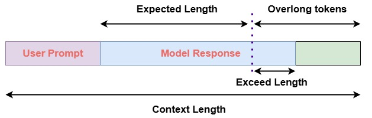

# Decoupled Clip and Dynamic Sampling Policy Optimization (DAPO)

Last updated: Jan 2, 2026

Doc Author: [Ziyi ZENG](https://github.com/ZiyiTsang) and [Wei Fu](https://github.com/garrett4wade)


Decoupled Clip and Dynamic Sampling Policy Optimization (DAPO) (Yu et al., 2025) is a
reinforcement learning framework designed for training large language models (LLMs) on
complex reasoning tasks. It improves upon conventional methods by introducing
**asymmetric clipping** through decoupled lower and upper bounds $\epsilon_{\text{low}}$ and $\epsilon_{\text{high}}$, enabling more adaptive
policy updates.

DAPO also employs a **dynamic sampling strategy** that excludes samples where all
responses are uniformly correct or incorrect, ensuring that gradient updates come from
informative and diverse outputs. To promote high-quality reasoning, it applies token-level
losses and reward shaping to discourage overly long or prematurely terminated responses.

The core objective is:

$$

J_{\text{DAPO}}(\theta) = \mathbb{E}_{\substack{(q,a) \sim \mathcal{D}, \\ \{o_i\}_{i=1}^G \sim \pi_{\theta_{\text{old}}}(o|q)}} \left[ \frac{1}{\sum_{i=1}^G |o_i|} \sum_{i=1}^G \sum_{t=1}^{|o_i|} \min\left( r_{i,t}(\theta) \hat{A}_{i,t}, \text{clip}\left( r_{i,t}(\theta), \textcolor{red}{1-\epsilon_{\text{low}}}, \textcolor{red}{1+\epsilon_{\text{high}}} \right) \hat{A}_{i,t} \right) \right]
$$

where $\hat{A}_{i,t}$ is the group-normalized advantage and $r_{i,t}(\theta)$ is the token-level policy ratio. Compared to GRPO’s symmetric clipping, DAPO’s asymmetric
design allows finer control over exploration and stability during training.

For more details, see the [DAPO paper](https://arxiv.org/abs/2503.14476).

## Core Parameters

AReaL natively supports dynamic sampling with arbitrary filtering conditions.
You can pass a `dynamic_filter_fn` to `PPOTrainer.train` for this purpose.
This function inputs the grouped trajectories that are sampled from the same prompt,
and outputs a boolean value. This value is then used to judge whether the trajectory
should be accepted for training or not.

For example, the following filter function satisfies DAPO's requirements:

```python
trainer.train(
    workflow=...,
    dynamic_filter_fn=lambda x: x["rewards"].mean() < 1 and x["rewards"].mean() > 0
)
```

Below are the DAPO-specific parameters that differ from GRPO:

- `actor.overlong_reward_penalty`: Whether to enable the overlong reward penalty.
- `actor.overlong_tokens`: The number of tokens at the tail considered overlong.
- `actor.overlong_penalty_factor`: The penalty factor applied to overlong responses.
- `actor.eps_clip`: The lower bound for clipping (default: `0.2`).
- `actor.eps_clip_higher`: The upper bound for clipping.
- `dynamic_bs`: Enables dynamic batch sizing. When `True`, batch collection stops when
  `(accepted + rejected) >= batch_size`, returning only accepted results. When `False`,
  the trainer returns `batch_size` results that have all been accepted.

### Overlong Penalty

The figure below illustrates the overlong penalty implementation in DAPO.



## Example Usage

> This algorithm is experimental and may not be stable.

We recommend modifying parameters in the configuration file
(e.g., `gsm8k_dapo_dynamic_bs.yaml`).

| Backend   | CMD                                                                                                                              |
| --------- | -------------------------------------------------------------------------------------------------------------------------------- |
| **local** | `python3 -m areal.launcher.local examples/math/gsm8k_rl.py --config examples/math/gsm8k_dapo_dynamic_bs.yaml --<other_args_to_overwrite>` |
| **ray**   | `python3 -m areal.launcher.ray examples/math/gsm8k_rl.py --config examples/math/gsm8k_dapo_dynamic_bs.yaml --<other_args_to_overwrite>`   |
| **slurm** | `python3 -m areal.launcher.slurm examples/math/gsm8k_rl.py --config examples/math/gsm8k_dapo_dynamic_bs.yaml --<other_args_to_overwrite>` |

## Baselines

Baselines are not yet available. Contributions are welcome!
