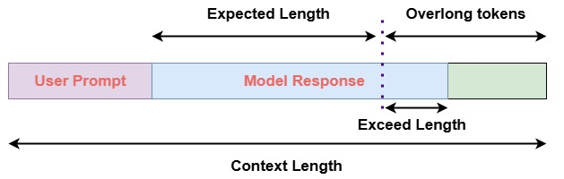

# Decoupled Clip and Dynamic Sampling Policy Optimization (DAPO)

Last updated: Sep 11,2025

Doc Author: [Ziyi ZENG](https://github.com/ZiyiTsang)

For more details:

- AReal Detail: [Paper of AReal](https://arxiv.org/abs/2505.24298)

- DAPO Detail: [Paper of Dr.GRPO](https://arxiv.org/abs/2503.20783)

## Algorithm Core Parameters

We only list the different parameters from GRPO here:

### Overlong Penalty

Here we briefly introduce the implementation details of DAPO.

## Example Usage

> The algorithm is experimental and may not be stable.

We recommend to change the parameter within the configuration file
(i.e.gsm8k_drgrpo.yaml).

| Backend   | CMD                                                                                                                                  |
| --------- | ------------------------------------------------------------------------------------------------------------------------------------ |
| **local** | `python3 -m areal.launcher.local examples/math/gsm8k_drgrpo.py --config examples/math/gsm8k_drgrpo.yaml --<other_args_to_overwrite>` |
| **ray**   | `python3 -m areal.launcher.ray examples/math/gsm8k_drgrpo.py --config examples/math/gsm8k_drgrpo.yaml --<other_args_to_overwrite>`   |
| **slurm** | `python3 -m areal.launcher.slurm examples/math/gsm8k_drgrpo.py --config examples/math/gsm8k_drgrpo.yaml --<other_args_to_overwrite>` |

## Example Usage

We still lack baseline, welcome to contribute!
