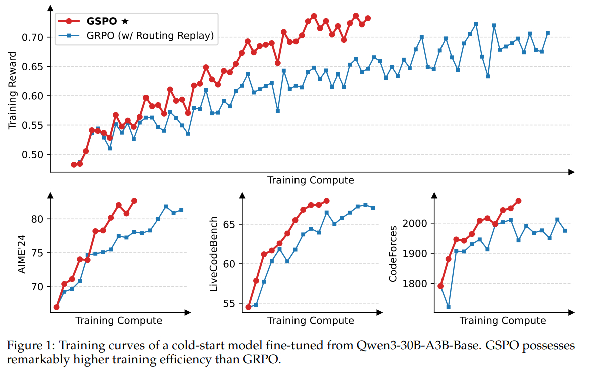

# Group Sequence Policy Optimization (GSPO)

Last updated: Oct 30, 2025

Author: [Bruce Li](https://github.com/HsiaoTsan)



Group Sequence Policy Optimization (GSPO), introduced by Zheng et al. (2025) in the context of training Qwen3 models, is a reinforcement learning algorithm that extends PPO by computing importance sampling ratios at the sequence level rather than the token level. Unlike standard PPO which computes a separate probability ratio for each token, GSPO calculates a single ratio per sequence as the geometric mean of per-token probability ratios, then applies this uniform ratio to all tokens within that sequence.

This sequence-level approach provides several key advantages: improved training stability especially for Mixture-of-Experts (MoE) models, reduced variance in policy updates when optimizing sequence-level rewards, and potential simplification of RL infrastructure design. GSPO has been successfully deployed in large-scale RL training for the Qwen3 model family.

## Algorithm Overview

The key distinction between GSPO and traditional PPO lies in the computation of importance sampling ratios:

**Standard PPO (token-level):**
- Computes per-token ratio: $r_{i,t}(\theta) = \frac{\pi_\theta(o_{i,t} \mid q, o_{i,<t})}{\pi_{\theta_{\text{old}}}(o_{i,t} \mid q, o_{i,<t})}$
- Each token has its own importance weight
- Advantages are computed and applied per token

**GSPO (sequence-level):**
- Computes sequence-level geometric mean ratio: $r_i(\theta) = \exp\left(\frac{1}{|o_i|}\sum_{t=1}^{|o_i|} \log\frac{\pi_\theta(o_{i,t} \mid q, o_{i,<t})}{\pi_{\theta_{\text{old}}}(o_{i,t} \mid q, o_{i,<t})}\right)$
- All tokens in a sequence share the same importance weight
- **Advantages are aggregated per sequence**: Each sequence contributes its total advantage (sum of per-token advantages) to the objective, ensuring gradient magnitude is independent of sequence length

## Key Differences from Related Algorithms

| Algorithm | Importance Ratio Level | Advantage Aggregation | Best Use Case |
|-----------|------------------------|----------------------|---------------|
| **PPO** | Token-level | Per-token | General RL tasks |
| **GRPO** | Token-level | Group-normalized per-token | Critic-free RL with sparse rewards |
| **GSPO** | Sequence-level (geometric mean) | Per-sequence sum of advantages | Sequence-level rewards, MoE training |

For more details:

- AReaL Detail: [Paper of AReaL](https://arxiv.org/abs/2505.24298)

- GSPO Detail: [Paper of GSPO](https://arxiv.org/abs/2507.18071)

- Qwen Team Blog: [GSPO Blog Post](https://qwenlm.github.io/blog/gspo/)

## Algorithm Core Parameters

GSPO shares most parameters with GRPO, with one key addition:

- `actor.importance_sampling_level`: Set to `"sequence"` to enable GSPO (default `"token"` for standard PPO/GRPO)

## Example Usage

We recommend reusing PPO-like training scripts, and changing parameters within the configuration file (e.g., `gsm8k_grpo.py` + `gsm8k_gspo.yaml`). 

| Backend   | CMD                                                                                                                              |
| --------- | -------------------------------------------------------------------------------------------------------------------------------- |
| **local** | `python3 -m areal.launcher.local examples/math/gsm8k_grpo.py --config examples/experimental/gspo/gsm8k_gspo.yaml --<other_args_to_overwrite>` |
| **ray**   | `python3 -m areal.launcher.ray examples/math/gsm8k_grpo.py --config examples/experimental/gspo/gsm8k_gspo.yaml --<other_args_to_overwrite>`   |
| **slurm** | `python3 -m areal.launcher.slurm examples/math/gsm8k_grpo.py --config examples/experimental/gspo/gsm8k_gspo.yaml --<other_args_to_overwrite>` |

To enable GSPO, set `importance_sampling_level: sequence` in the actor configuration:

```yaml
actor:
  importance_sampling_level: sequence  # 'token' for standard PPO, 'sequence' for GSPO
  # ... other configurations
```

### Adding GSPO to Other Algorithms

GSPO can be easily applied to any PPO-based algorithm by adding the `importance_sampling_level` parameter. For example, to use GSPO with GRPO:

```bash
python3 -m areal.launcher.local examples/math/gsm8k_grpo.py --config examples/math/gsm8k_grpo.yaml +actor.importance_sampling_level=sequence
```

Note: The plus sign (`+`) is required when the key `importance_sampling_level` is not in the YAML file.

## When to Use GSPO

GSPO is particularly beneficial in the following scenarios:

- **Sequence-level rewards**: When rewards are assigned based on entire sequences (e.g., task success/failure) rather than individual tokens
- **MoE model training**: GSPO has been shown to stabilize Mixture-of-Experts reinforcement learning training
- **High variance in token-level gradients**: The sequence-level geometric mean helps reduce variance
- **Long-horizon tasks**: When token-level credit assignment is difficult or unreliable

## Baselines

We still lack baselines, welcome to contribute!
