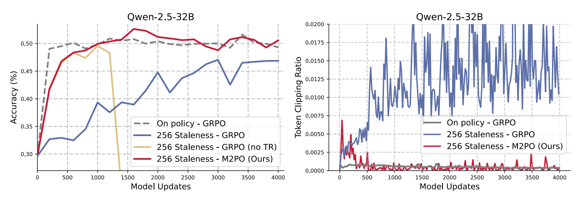
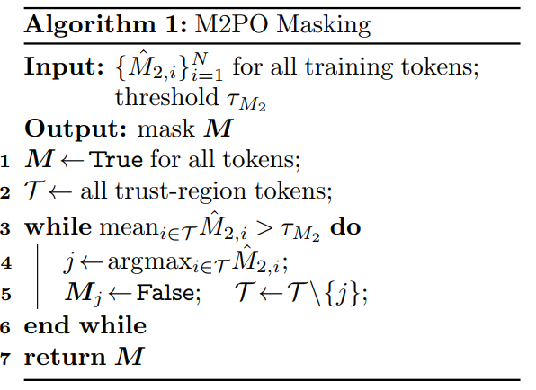
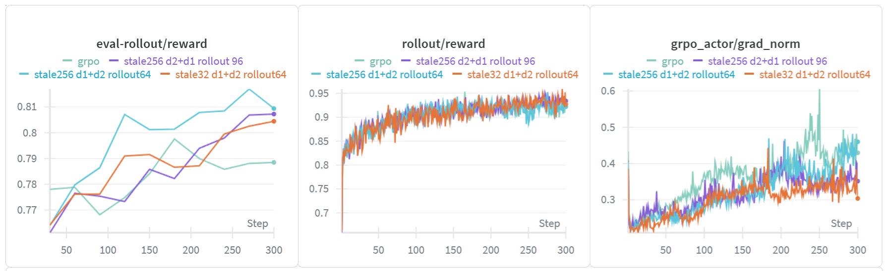

# Second-Moment Trust Policy Optimization (M2PO)

Last updated: Oct 23, 2025

Author: [Jingyuan Ma](https://github.com/tsjyma)

Second-Moment Trust Policy Optimization (M2PO) (Zheng et al., 2025), is an RL method that achieves stable off-policy training even with data stale by at least 256 model updates and matches on-policy performance by constraining the second moment of importance weights to suppress only extreme outliers while preserving informative updates.

The first step of M2PO is to compute the second momentum:
$$
\hat{M_2}=\frac{1}{N}\sum_{i=1}^NM_{2,i}=\frac{1}{N}\sum_{i=1}^N(\log{r_i})^2=\frac{1}{N}\sum_{i=1}^N\left(\log\frac{\pi_\theta (a_i|s_i)}{\pi_{behav}(a_i|s_i)}\right)^2
$$

The second step is to compute the second momentum mask:

The final step is to optimize the objective:
$$
J_{\text{M2PO}}(\theta) = \frac{1}{\sum_{i=1}^G|o_i|}\sum_{i=1}^G\sum_{t=1}^{|o_i|}M_{i,t}\frac{\pi_\theta(o_i|q)}{\pi_{\theta_{old}}(o_i|q)}A_{i,t},~~~~M_{i,t}\in\{0,1\}.
$$
Where $M$ is computed in the second step and
$$
A_{i,t}=\frac{r_i-mean(\{R_i\}_{i=1}^G)}{std(\{R_i\}_{i=1}^G)}
$$

For more details:

- AReal Detail: [Paper of AReal](https://arxiv.org/abs/2505.24298)

- M2PO Detail: [Paper of M2PO](https://arxiv.org/abs/2510.01161)

## Core Parameters

- `actor.m2_threshold`: The threshold for the mean of the second momentum, used in computing the M2PO mask as $\tau_{M_2}$

## Example Usage

We recommend to change the parameter within the configuration file
(i.e.gsm8k_m2po.yaml).

| Backend   | CMD                                                                                                                                 |
| --------- | ----------------------------------------------------------------------------------------------------------------------------------- |
| **local** | `python3 examples/math/gsm8k_rl.py --config examples/math/gsm8k_m2po.yaml scheduler.type=local --<other_args_to_overwrite>`       |
| **ray**   | `python3 examples/math/gsm8k_rl.py --config examples/math/gsm8k_m2po.yaml scheduler.type=ray --<other_args_to_overwrite>`         |
| **slurm** | `python3 examples/math/gsm8k_rl.py --config examples/math/gsm8k_m2po.yaml scheduler.type=slurm --<other_args_to_overwrite>`       |

## Test Result

In this test, we name the trails by the rules as follow:
- **stale:** the value of `max_head_offpolicyness`
- **dx+dy**: x for the number of rollout workers and y for the number of training workers
- **rollout**: the value of `max_concurrent_rollout`

The setting for GRPO is stale 256 d2+d1 rollout 96

The key findings in the trails are as follow:
- The `grad_norm` of GRPO is higher than M2PO, which may cause training instability.
- The evaluate reward of M2PO is higher than GRPO.
