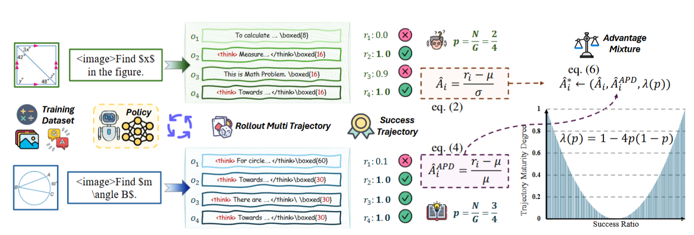

# Mixed Advantage Policy Optimization (MAPO)

Last updated: Sep 27, 2025

Author: [Ziyi ZENG](https://github.com/ZiyiTsang)

This paper introduces Mixed Advantage Policy Optimization (MAPO), an improved Group Relative Policy Optimization (GRPO) strategy designed to enhance the reasoning performance of foundation models. While GRPO has been effective in post-training foundation models for reasoning tasks, it suffers from "advantage reversion" and "advantage mirror" problems, which lead to an unreasonable allocation of advantage across different query samples. MAPO addresses these limitations by introducing the concept of "trajectory certainty" and proposing an "Advantage Percent Deviation" (APD) for high-certainty trajectories. Furthermore, it dynamically reweights the advantage function based on trajectory certainty through "Trajectory Certainty Reweight" (TCR). This adaptive approach allows MAPO to configure the advantage function to account for sample-specific characteristics, thereby mitigating the shortcomings of prior advantage function formulations and producing more stable and accurate reasoning performance across diverse tasks.

The overall surrogate objective is:

$$\mathcal{J}_{\mathrm{GRPO}}(\theta)=\mathbb{E}_{q\sim\rho_{Q}}\mathbb{E}_{o\sim\pi_{old}(\cdot|q)}\left[\frac{1}{G}\sum_{i}^{G}f_{\epsilon}\left(\frac{\pi_{\theta}(o_{i}|q)}{\pi_{old}(o_{i}|q)},\hat{\Lambda}_{i}\right)\right]-\beta\mathbb{D}_{KL}[\pi_{\theta}||\pi_{ref}],$$
where:
$$f_\epsilon(x,y)=\min(xy,\mathrm{clip}(x,1-\epsilon,1+\epsilon)y)$$

$$\lambda(p)=1-4p(1-p)\in[0,1]\quad(p\in[0,1])$$

$$\hat{A}_i^*=(1-\lambda(p))*\underbrace{\frac{r_i-\mu}{\sigma}}_{\text{Deviation-based}}+\lambda(p)*\underbrace{\frac{r_i-\mu}{\mu}}_{\text{Mean-based}}.$$

For more details:

- AReal Detail: [Paper of AReal](https://arxiv.org/abs/2505.24298)

- MAPO Detail: [Paper of MAPO](https://arxiv.org/abs/2509.18849v3)

## Algorithm Core Parameters

- `actor.adv_norm.aggregation_mode`: the implementation of adv_norm. 'native' is the z-score normalization used by GRPO, while 'mix' is the implementation for MAPO.

## Notice
For MAPO implementation, following constraints should be met:

1. 'reward_function' should return binary result of any value. High value represents the successful trajectory, while the lower value represent the fail trajectory.
2. the 'overlong_reward_panelty' should be disable

## Example Usage

We recommend to change the parameter within the configuration file
(i.e. gsm8k_mapo.yaml).

| Backend   | CMD                                                                                                                              |
| --------- | -------------------------------------------------------------------------------------------------------------------------------- |
| **local** | `python3 -m areal.launcher.local examples/experimental/mapo/gsm8k_mapo.py --config examples/experimental/mapo/gsm8k_mapo.yaml --<other_args_to_overwrite>` |
| **ray**   | `python3 -m areal.launcher.ray examples/experimental/mapo/gsm8k_mapo.py --config examples/experimental/mapo/gsm8k_mapo.yaml --<other_args_to_overwrite>`   |
| **slurm** | `python3 -m areal.launcher.slurm examples/experimental/mapo/gsm8k_mapo.py --config examples/experimental/mapo/gsm8k_mapo.yaml --<other_args_to_overwrite>` |

## Baselines

We still lack baseline, welcome to contribute!
