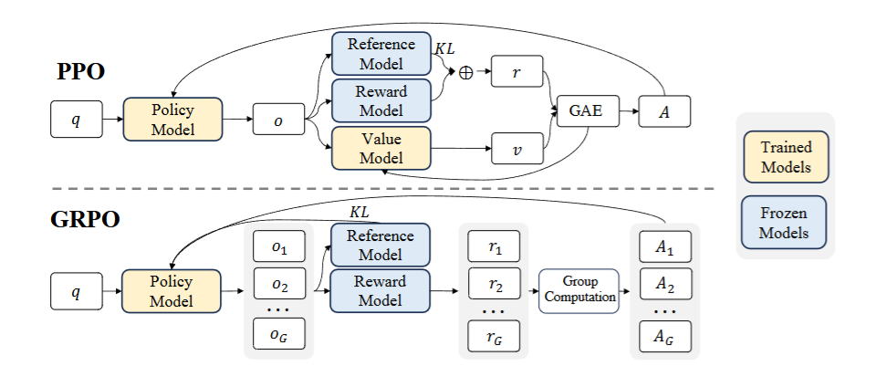

# Proximal Policy Optimization (PPO)

Last updated: Sep 28, 2025

Author: [Honghua DONG](https://github.com/dhh1995)

Group Relative Policy Optimization (GRPO), introduced in DeepSeekMath (Shao et al.,
2024), is an RL method that removes the need for a value function (critic). Instead, it
estimates advantage by normalizing rewards within a group of sampled responses for the
same prompt. This normalization emphasizes differences between candidate outputs,
preserving the reliability of the gradient signal even when rewards are sparse.

The overall core objective is:

$$
J_{\text{GRPO}}(\theta) = \mathbb{E}_{\substack{q \sim P(Q),\\ \{o_i\}_{i=1}^G \sim \pi_{\theta_{\text{old}}}(O|q)}} \left[ \frac{1}{G} \sum_{i=1}^G \frac{1}{|o_i|} \sum_{t=1}^{|o_i|} \min\left( r_{i,t}(\theta) \hat{A}_{i,t},\ \text{clip}\left( r_{i,t}(\theta),\ 1-\epsilon,\ 1+\epsilon \right) \hat{A}_{i,t} \right) - \beta D_{\mathrm{KL}}\left[ \pi_\theta \middle| \pi_{\text{ref}} \right] \right]
$$
where:
$$
r_{i,t}(\theta) = \frac{\pi_\theta(o_{i,t} \mid q, o_{i,<t})}{\pi_{\theta_{\text{old}}}(o_{i,t} \mid q, o_{i,<t})},
\hat{A}_{i,t} = \frac{r_i - \text{mean}(\{R_i\}_{i=1}^G)}{\text{std}(\{R_i\}_{i=1}^G)}.
$$

For more details:

- AReal Detail: [Paper of AReal](https://arxiv.org/abs/2505.24298)

- PPO Detail: [Paper of PPO](https://arxiv.org/abs/1707.06347)

## Algorithm Core Parameters

We only list the different parameters from GRPO here:

- `critic.path`: The path to the critic model.

## Example Usage

We recommend to change the parameter within the configuration file
(i.e.gsm8k_ppo.yaml).

| Backend   | CMD                                                                                                                              |
| --------- | -------------------------------------------------------------------------------------------------------------------------------- |
| **local** | `python3 -m areal.launcher.local examples/math/gsm8k_ppo.py --config examples/math/gsm8k_ppo.yaml --<other_args_to_overwrite>` |
| **ray**   | `python3 -m areal.launcher.ray examples/math/gsm8k_ppo.py --config examples/math/gsm8k_ppo.yaml --<other_args_to_overwrite>`   |
| **slurm** | `python3 -m areal.launcher.slurm examples/math/gsm8k_ppo.py --config examples/math/gsm8k_ppo.yaml --<other_args_to_overwrite>` |

## Baselines

We still lack baseline, welcome to contribute!
