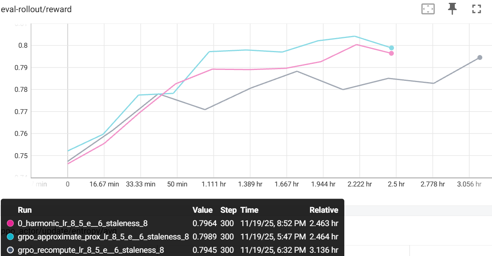

# Proximal Log-Probability Approximation

Last updated: Nov 19, 2025

## Overview

Proximal log-probability approximation is an optimization technique for **decoupled PPO** that eliminates the expensive forward pass required to compute the proximal policy's log-probabilities for importance ratio computation.

In decoupled PPO (off-policy PPO), we compute importance ratios using three policies:
- **π_behave**: Behavior policy (generated the samples)
- **π_proximal**: Proximal policy (one training step behind current policy)
- **π_θ**: Current policy (being optimized)

Standard decoupled PPO requires recomputing π_proximal via a full forward pass every training step. This feature **approximates** π_proximal using version-aware interpolation between cached π_behave and computed π_θ:

$$
\alpha = \frac{v_{proximal} - v_{behave}}{v_{\theta} - v_{behave}}, \quad \log \pi_{proximal} \approx \log \pi_{behave} + \alpha \cdot (\log \pi_{\theta} - \log \pi_{behave})
$$

where $v$ denotes the policy version when each token was generated.

### Performance Benefits

- **27% faster training**: Eliminates one full forward pass per step (163 min vs 207 min for 300 steps)
- **Better evaluation reward**: Achieves 0.799 vs 0.795 on GSM8K
- **Comparable task reward**: 0.937 vs 0.954 (within 2%)
- **Zero user script changes**: Works automatically with existing decoupled PPO code

## Algorithm Core Parameters

- `actor.use_decoupled_loss`: Must be `true` to enable decoupled PPO (required for approximation)
- `actor.prox_logp_method`: Method for computing proximal policy log-probabilities (default: `"recompute"`)
  - `"recompute"`: Standard decoupled PPO, recompute proximal policy via forward pass
  - `"rollout"`: Use behavior policy from rollout as proximal policy (skip forward pass)
  - `"loglinear"`: Use log-linear interpolation to approximate proximal policy (fast, recommended)
  - `"metrics"`: Like recompute, but also compute loglinear approximation and log comparison metrics

## Example Usage

### Production Configuration (Maximum Speed)

**Log-linear method (recommended for best eval reward):**
```yaml
actor:
  use_decoupled_loss: true
  prox_logp_method: loglinear  # Enables approximation, skips forward pass
```

**Rollout method (uses behavior policy as-is):**
```yaml
actor:
  use_decoupled_loss: true
  prox_logp_method: rollout  # Uses π_behave as π_proximal
```

Run with:
```bash
python -m areal.launcher.local examples/math/gsm8k_grpo.py \
  --config examples/experimental/prox_approx/gsm8k_grpo_prox_approx.yaml
```

### Evaluation Configuration (With Metrics)

```yaml
actor:
  use_decoupled_loss: true
  prox_logp_method: metrics  # Compute ground truth + approximation metrics
```

For more examples, see `examples/experimental/prox_approx/`.

## Baselines

Based on GSM8K experiments with Qwen2.5-1.5B-Instruct:

**Setup:**
- Training steps: 300
- Sample staleness: 8 steps (off-policy scenario)
- Model: Qwen2.5-1.5B-Instruct
- Dataset: GSM8K

| Method | Training Time | Final Task Reward | Final Eval Reward | Speedup |
|--------|---------------|-------------------|-------------------|---------|
| Standard Decoupled PPO (Recompute) | 207 min | 0.954 | 0.795 | 1.0× (baseline) |
| + Proximal Approximation (loglinear) | 163 min | 0.937 | **0.799** | **1.27×** |
| + Proximal Approximation (linear) | ~163 min | 0.944 | 0.796 | **1.27×** |

**Key findings:**
- **27% faster**: Both approximation methods save ~44 minutes over 300 steps
- **loglinear method**: Best evaluation reward (0.799), slightly lower task reward (0.937). Linear interpolation in log-space.
- **linear method**: Better task reward (0.944), matches baseline eval reward (0.796). Linear interpolation in probability space.
- **Comparable performance**: Both methods within 2% of recompute baseline on all metrics
- **Stable training**: Smooth convergence with 8-step staleness (off-policy scenario)
- **Proven effective**: Works well in realistic off-policy settings



---

## Additional Details

### Approximation Methods

**`"loglinear"` (Recommended)**
- Formula: $\log \pi_{prox} = \log \pi_{behave} + \alpha \cdot (\log \pi_{\theta} - \log \pi_{behave})$
- Linear interpolation in log-space (geometric mean in probability space)
- Simple, fast, stable
- Best evaluation reward (0.799 on GSM8K)
- Proven effective on GSM8K with Qwen2.5-1.5B-Instruct

**`"linear"` (Alternative)**
- Formula: $\log \pi_{prox} = \log[(1-\alpha) \cdot \pi_{behave} + \alpha \cdot \pi_{\theta}]$
- Linear interpolation in probability space (arithmetic mean), then converts to log space
- Better task reward (0.944 on GSM8K)
- Also proven effective on GSM8K with Qwen2.5-1.5B-Instruct

**`"rollout"` (Metrics Baseline)**
- Formula: $\log \pi_{prox} = \log \pi_{behave}$
- Uses behavior policy directly as proximal policy (no interpolation)
- Only used internally for metrics comparison when `prox_logp_method="metrics"`
- Not available as a user-facing configuration option (use `use_decoupled_loss=false` for similar behavior)

### Configuration Logic

```
use_decoupled_loss?
├─ No → Standard PPO (approximation not available)
└─ Yes → Decoupled PPO enabled
    └─ use_prox_approx?
        ├─ No → Always recompute π_proximal via forward pass
        └─ Yes → Approximation enabled
            └─ recompute_logprob?
                ├─ No → Production mode (approximation only, no forward pass)
                └─ Yes → Evaluation mode (compute both ground truth + approximation)
                    └─ log_prox_approx_metrics?
                        ├─ No → Don't log comparison metrics
                        └─ Yes → Log approximation quality metrics
```

### Metrics Explanation

When `log_prox_approx_metrics=true` and `recompute_logprob=true`, the following metrics are logged under `ppo_actor/update/prox_approx/`:

**Ground Truth:**
- `prox_logp_gt/avg`: Average ground truth proximal log-probability

**Per-Method Metrics** (e.g., `linear/`, etc.):
- `{method}/approx_logp/avg`: Average approximated log-probability
- `{method}/abs_error/avg`: Average absolute error
- `{method}/rel_error/avg`: Average relative error (%)
- `{method}/squared_error/avg`: Average squared error
- `{method}/imp_weight_error/avg`: Error in importance weight (exp space)

**Typical good values:**
- Absolute error: 0.001-0.01
- Relative error: 0.1%-1%
- Importance weight error: 0.001-0.01

### When to Use

**✅ Recommended:**
- Production decoupled PPO training
- Off-policy scenarios with moderate staleness (1-5 updates)
- Large-scale training where forward pass is expensive
- After validating approximation quality with metrics

**⚠️ Use with caution:**
- High sample staleness (>10 updates) - monitor metrics closely
- Erratic policy updates - approximation assumes smooth changes
- Initial training phase - policy changing rapidly

**❌ Don't use:**
- Standard on-policy PPO (not applicable)
- Debugging mode when exact values needed
- When forward pass is already fast (small models)

### Implementation Notes

**Version Tracking:**
Each generated token carries a version number indicating which policy version generated it. The approximation uses these versions to compute the interpolation weight α.

**Automatic Optimization:**
When `use_prox_approx=true` and `recompute_logprob=false`, the forward pass is automatically skipped in `compute_logp()`, requiring zero changes to user scripts.

**Safety Checks:**
- Validates configuration combinations at initialization
- Checks for NaN/Inf in approximated values
- Ensures versions are available when needed
- Provides clear error messages for misconfigurations
