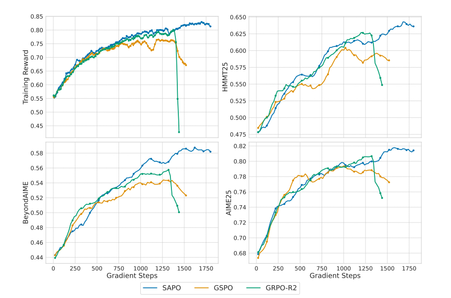

# Soft Adaptive Policy Optimization (SAPO)

Last updated: Dec 3, 2025

Author: [Bruce Wu](https://github.com/Bruce-rl-hw)



Soft Adaptive Policy Optimization (SAPO), introduced by Wu et al. (2025), is a clipping-free policy gradient algorithm that replaces PPO's hard clipping mechanism with soft sigmoid gates. Unlike standard PPO which clips probability ratios to constrain policy updates, SAPO uses asymmetric sigmoid gates with 4/τ gradient normalization to provide smooth gradients and adaptive control based on advantage signs.

This soft gating approach provides several key advantages: smooth gradients without clipping discontinuities, asymmetric control allowing different behaviors for positive and negative advantages, and theoretically grounded gradient normalization ensuring consistent gradient magnitudes across different temperature settings. SAPO has shown promising results in reducing training variance while maintaining sample efficiency.

## Algorithm Overview

The key distinction between SAPO and traditional PPO lies in the loss computation:

**Standard PPO (with clipping):**
- Computes per-token ratio: $r_t(\theta) = \frac{\pi_\theta(a_t \mid s_t)}{\pi_{\theta_{\text{old}}}(a_t \mid s_t)}$
- Clips the ratio: $r_t^{\text{clip}} = \text{clip}(r_t, 1-\epsilon, 1+\epsilon)$
- Loss: $L^{\text{PPO}} = -\mathbb{E}_t[\min(r_t A_t, r_t^{\text{clip}} A_t)]$

**SAPO (with soft gates):**
- Computes per-token ratio: $r_t(\theta) = \frac{\pi_\theta(a_t \mid s_t)}{\pi_{\theta_{\text{old}}}(a_t \mid s_t)}$
- Applies asymmetric sigmoid gates:
  - For positive advantages: $g_t^+ = \frac{4}{\tau_{\text{pos}}} \sigma(\tau_{\text{pos}} (r_t - 1))$
  - For negative advantages: $g_t^- = \frac{4}{\tau_{\text{neg}}} \sigma(\tau_{\text{neg}} (r_t - 1))$
- Loss: $L^{\text{SAPO}} = -\mathbb{E}_t[g_t A_t]$ where $g_t = \begin{cases} g_t^+ & \text{if } A_t > 0 \\ g_t^- & \text{if } A_t \leq 0 \end{cases}$

The 4/τ normalization ensures that the gradient magnitude around $r_t = 1$ is consistent regardless of the temperature parameter.

## Key Differences from Related Algorithms

| Algorithm | Policy Constraint | Gradient Property | Advantage Handling |
|-----------|-------------------|-------------------|-------------------|
| **PPO** | Hard clipping ($\epsilon$-region) | Discontinuous at clip boundaries | Symmetric |
| **GRPO** | Hard clipping (group-normalized) | Discontinuous at clip boundaries | Symmetric |
| **SAPO** | Soft sigmoid gates ($\tau$-controlled) | Smooth and continuous | Asymmetric ($\tau_{\text{pos}}$, $\tau_{\text{neg}}$) |

## Key Features

### 1. Smooth Gradients
Unlike PPO's hard clipping which creates gradient discontinuities, SAPO's sigmoid gates provide smooth gradients throughout the optimization process. This can lead to more stable training and better convergence properties.

### 2. Asymmetric Control
SAPO uses separate temperature parameters for positive and negative advantages:
- $\tau_{\text{pos}}$: Controls gate sharpness for positive advantages (actions to encourage)
- $\tau_{\text{neg}}$: Controls gate sharpness for negative advantages (actions to discourage)

This asymmetry allows fine-grained control over policy updates based on advantage signs.

### 3. Theoretically Grounded Normalization
The 4/τ coefficient ensures that sigmoid gates have consistent gradient magnitudes around the reference point ($r_t = 1$), regardless of temperature settings. This makes hyperparameter tuning more intuitive.

For more details:

- AReaL Detail: [Paper of AReaL](https://arxiv.org/abs/2505.24298)

- SAPO Detail: [Paper of SAPO](https://arxiv.org/abs/2511.20347)

## Algorithm Core Parameters

SAPO introduces three new parameters while maintaining compatibility with existing PPO infrastructure:

- `actor.use_sapo_loss`: Set to `true` to enable SAPO (default `false` for standard PPO)
- `actor.sapo_tau_pos`: Temperature for positive advantages (default `1.0`, higher = sharper gate)
- `actor.sapo_tau_neg`: Temperature for negative advantages (default `1.05`, higher = sharper gate)
- `actor.use_decoupled_loss`: Must be set to `false` for SAPO (SAPO doesn't use proximal log probabilities)

## Example Usage

We provide a dedicated SAPO configuration file for GSM8K training:

| Backend   | CMD                                                                                                                              |
| --------- | -------------------------------------------------------------------------------------------------------------------------------- |
| **local** | `python3 -m areal.launcher.local examples/math/gsm8k_rl.py --config examples/math/gsm8k_sapo.yaml --<other_args_to_overwrite>` |
| **ray**   | `python3 -m areal.launcher.ray examples/math/gsm8k_rl.py --config examples/math/gsm8k_sapo.yaml --<other_args_to_overwrite>`   |
| **slurm** | `python3 -m areal.launcher.slurm examples/math/gsm8k_rl.py --config examples/math/gsm8k_sapo.yaml --<other_args_to_overwrite>` |

To enable SAPO, use the following configuration:

```yaml
actor:
  use_sapo_loss: true
  sapo_tau_pos: 1.0       # Temperature for positive advantages
  sapo_tau_neg: 1.05      # Temperature for negative advantages (slightly sharper)
  use_decoupled_loss: false  # Required for SAPO
  # ... other configurations
```

### Adding SAPO to Existing Configurations

SAPO can be easily applied to any existing PPO/GRPO configuration by adding the SAPO parameters:

```bash
# Enable SAPO on existing GRPO config
python3 -m areal.launcher.local examples/math/gsm8k_rl.py \
  --config examples/math/gsm8k_grpo.yaml \
  +actor.use_sapo_loss=true \
  +actor.sapo_tau_pos=1.0 \
  +actor.sapo_tau_neg=1.05 \
  actor.use_decoupled_loss=false
```

Note: The plus sign (`+`) is required when the key is not in the original YAML file.

## When to Use SAPO

SAPO is particularly beneficial in the following scenarios:

- **High-variance training**: When PPO's hard clipping causes training instability
- **Fine-grained control needed**: When you want different update magnitudes for encouraging vs discouraging actions
- **Smooth optimization preferred**: When gradient continuity is important for convergence
- **Hyperparameter sensitivity**: SAPO's normalized gates may be more robust to temperature changes than PPO's epsilon

## Hyperparameter Guidelines

### Temperature Selection

- **$\tau_{\text{pos}}$ and $\tau_{\text{neg}}$ around 1.0**: Similar behavior to PPO with $\epsilon \approx 0.2$
- **Higher temperatures (1.5-2.0)**: Sharper gates, stronger constraint (similar to smaller PPO epsilon)
- **Lower temperatures (0.5-0.8)**: Softer gates, weaker constraint (similar to larger PPO epsilon)
- **Asymmetry**: Common pattern is $\tau_{\text{neg}} > \tau_{\text{pos}}$ to be more conservative about discouraging actions

### Decoupled Loss

SAPO requires `use_decoupled_loss=false` because it directly optimizes against the old policy without using proximal approximations. This simplifies the algorithm while maintaining effectiveness.

## Baselines

Experimental results coming soon! Welcome to contribute benchmarks on various tasks.
