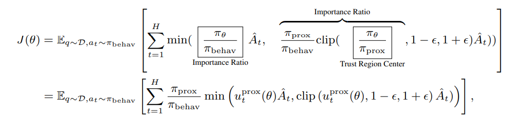

# Training Algorithm Implementation

## Approach 1: Using AReaLite (Recommended)

AReaLite structures RL algorithms around two core components:

- **RolloutWorkflow**: Defines what data to generate during rollouts
- **TrainEngine**: Defines how to process the generated data for training

We'll demonstrate this by implementing an RL algorithm similar to ReMax.

### Step 1: Implementing the RolloutWorkflow

The rollout workflow generates both greedy and sampled completions, then uses the reward
difference as the final training signal:

```python
class ReMaxRLVRWorkflow(RolloutWorkflow):
    async def arun_episode(self, engine: InferenceEngine, data):
        # Prepare input tokens from chat messages
        input_ids = self.tokenizer.apply_chat_template(
            data["messages"],
            tokenize=True,
            add_generation_prompt=True,
            enable_thinking=self.enable_thinking,
        )

        n_samples = self.gconfig.n_samples
        rid = uuid.uuid4().hex

        # Create requests for both sampled and greedy generation
        sample_req = LLMRequest(
            rid=rid,
            input_ids=input_ids,
            gconfig=self.gconfig,
        )
        greedy_req = LLMRequest(
            rid=rid,
            input_ids=input_ids,
            gconfig=self.gconfig.new(greedy=True),
        )

        # Generate both responses concurrently
        resp, greedy_resp = await asyncio.gather(
            engine.agenerate(sample_req),
            engine.agenerate(greedy_req),
        )

        # Calculate rewards for both completions
        prompt_str = self.tokenizer.decode(input_ids)
        completions_str = self.tokenizer.decode(resp.output_tokens)

        sample_reward = self.reward_fn(
            prompt=prompt_str,
            completions=completions_str,
            prompt_ids=resp.input_tokens,
            completion_ids=resp.output_tokens,
            **data,
        )

        greedy_completions = self.tokenizer.decode(greedy_resp.output_tokens)
        greedy_reward = self.reward_fn(
            prompt=prompt_str,
            completions=greedy_completions,
            prompt_ids=greedy_resp.input_tokens,
            completion_ids=greedy_resp.output_tokens,
            **data,
        )

        # Package results for training
        res = dict(
            # Add batch dimension
            input_ids=torch.tensor(resp.input_tokens + resp.output_tokens).unsqueeze(0),
            loss_mask=torch.tensor([0] * resp.input_len + [1] * resp.output_len).unsqueeze(0),
            versions=torch.tensor([-1] * resp.input_len + resp.output_versions).unsqueeze(0),
            attention_mask=torch.ones(resp.input_len + resp.output_len, dtype=torch.bool).unsqueeze(0),
            # Use reward difference across all tokens
            rewards=torch.tensor([float(sample_reward - greedy_reward)] * (resp.input_len + resp.output_len)),
        )

        return TensorDict(res, batch_size=[1])
```

> **Note**: For detailed guidance on customizing rollout workflows, see the
> [agent customization guide](agent.md).

### Step 2: Implementing the REINFORCE Training Algorithm

Training algorithms are implemented by subclassing `TrainEngine` and using its atomic
operations like `forward`, `train_batch`, and `eval_batch`.

First, let's define the REINFORCE loss function:

```python
def reinforce_loss_fn(logits, data):
    input_ids = data["input_ids"]
    loss_mask = data["loss_mask"].bool()
    rewards = data["rewards"]

    logprobs = gather_logprobs(
        logits, torch.roll(input_ids, shifts=-1, dims=-1)
    )
    loss = -logprobs * rewards
    loss = torch.where(loss_mask, loss, 0.0)

    return loss.sum() / loss_mask.count_nonzero()
```

Next, we implement the training engine. We use a two-class design to maintain backend
compatibility:

```python
class ReinforceActor:
    def __init__(self, engine: TrainEngine):
        self.engine = engine

    def train_reinforce(self, data: TensorDict):
        # Enable gradient checkpointing
        self.engine.train()
        return self.engine.train_batch(
            data,
            loss_fn=reinforce_loss_fn,
            loss_weight_fn=lambda x: x["loss_mask"].count_nonzero(),
        )

class FSDPReinforceActor(FSDPEngine):
    def __init__(self):
        self.actor = ReinforceActor(self)

    def train_reinforce(self, *args, **kwargs):
        return self.actor.train_reinforce(*args, **kwargs)
```

**Why two classes?** This design separates concerns:

1. **Backend Agnostic Logic**: `ReinforceActor` contains the core REINFORCE algorithm
   that works with any backend (FSDP, DeepSpeed, Megatron) since they share the same
   `train_batch` API.

1. **Backend-Specific Features**: `FSDPReinforceActor` inherits from `FSDPEngine` to
   provide backend-specific utilities like `save`, `load`, and `upload_weights`. For
   other backends, you'd create `MegatronReinforceActor`, etc.

> **Note**: This pattern is similar to interfaces in Go or traits in Rust, adapted for
> Python's object model.

### Step 3: Composing the Complete Training Loop

The main training loop brings everything together:

```python
def main(args):
    # Initialize inference engine for rollouts
    rollout = RemoteSGLangEngine(config.rollout)
    rollout.initialize(None, ft_spec)

    # Initialize training engine
    actor = FSDPReinforceActor(config=config.actor)
    actor.initialize(None, ft_spec)

    # Create rollout workflow
    workflow = ReMaxRLVRWorkflow(
        reward_fn=gsm8k_reward_fn,
        gconfig=config.gconfig,
        tokenizer=tokenizer,
    )

    # Main training loop
    for global_step in range(max_steps):
        # Generate training data
        with stats_tracker.record_timing("rollout"):
            try:
                data = next(data_generator)
            except StopIteration:
                data_generator = iter(train_dataloader)
                data = next(data_generator)

            batch = rollout.rollout_batch(data, workflow=workflow)

        batch = batch.to(actor.device)

        # Synchronize all processes
        dist.barrier()
        torch.cuda.synchronize()

        # Training step
        with (
            stats_tracker.record_timing("train_step"),
            stats_tracker.scope("actor"),
        ):
            stats = actor.train_reinforce(batch)
            actor.step_lr_scheduler()

        # Update model weights
        with stats_tracker.record_timing("update_weights"):
            # Weight update logic here
            ...
```

## Approach 2: Using Legacy ModelInterface (Not Recommended)

The legacy approach encapsulates algorithms in a `ModelInterface` with three core
methods:

```python
# From realhf/api/core/model_api.py
class ModelInterface(abc.ABC):
    """Interface for model training, inference, and generation.

    This interface follows the dependency injection pattern, allowing
    algorithms like REINFORCE and PPO to use the same underlying model
    while exhibiting different training behaviors.
    """

    def inference(
        self,
        model: Model,
        data: SequenceSample,
        mb_spec: MicroBatchSpec,
    ) -> SequenceSample | None:
        raise NotImplementedError()

    def generate(
        self,
        model: Model,
        data: SequenceSample,
        mb_spec: MicroBatchSpec,
    ) -> SequenceSample | None:
        raise NotImplementedError()

    def train_step(
        self,
        model: Model,
        data: SequenceSample,
        mb_spec: MicroBatchSpec,
    ) -> Dict | List[Dict]:
        raise NotImplementedError()
```

When the dataflow is fixed, you typically only need to modify the algorithm interface
file.

> **Note**: We recommend using asynchronous RL so you can customize generation behavior
> by [modifying your RL agent](agent.md) instead of the `generate` method.

### Example 1: Grouped Advantage Normalization

Let's modify PPO's global advantage normalization to use grouped normalization (GRPO
approach).

#### Understanding Data Organization

Each batch contains multiple prompts (batch size) and each prompt may have multiple
responses (group size). So total sequences = batch_size × group_size.

Sequences have different lengths but are packed into a 1D tensor. We use `cu_seqlens`
(cumulative sequence lengths) to mark boundaries, similar to flash-attention.

#### Implementation

The standard PPO normalization looks like:

```python
@dataclass
class PPOActorInterface(ModelInterface):
    def train_step(self, model: Model, data: SequenceSample, mb_spec: MicroBatchSpec) -> Dict | List[Dict]:
        # ...
        if self.adv_norm:
            advantages = masked_normalization(advantages, loss_mask)
        # ...
```

For grouped normalization, we partition advantages by group:

```python
@dataclass
class PPOActorInterface(ModelInterface):
    group_adv_norm: bool = False

    def train_step(self, model: Model, data: SequenceSample, mb_spec: MicroBatchSpec) -> Dict | List[Dict]:
        # ...
        if self.adv_norm:
            if not self.group_adv_norm:
                advantages = masked_normalization(advantages, loss_mask)
            else:
                n_samples = data.bs
                adv_list = []
                for i in range(0, n_samples, self.group_size):
                    # Define chunk boundaries
                    s = short1cu_seqlens[i]
                    e = short1cu_seqlens[i + self.group_size]

                    # Extract advantages for this group
                    adv = advantages[s:e]
                    mask = loss_mask[s:e]

                    # Normalize within group
                    advn = masked_normalization(adv, mask, all_reduce=False)
                    adv_list.append(advn)

                advantages = torch.cat(adv_list, 0)
        # ...
```

#### Configuration Changes

Update the experiment configuration to expose the new parameter:

```python
@dataclasses.dataclass
class PPOMATHConfig(CommonExperimentConfig, PPOMATHExperimentOptions):
    group_adv_norm: bool = False

    @property
    def rpcs(self):
        # ...
        actor_interface = ModelInterfaceAbstraction(
            "ppo_actor",
            args={
                **copy.deepcopy(self.ppo_kwargs),
                "group_adv_norm": self.group_adv_norm,
                # ...
            },
        )
```

### Example 2: Decoupled PPO Loss

The decoupled PPO loss (from AReaL's paper) recomputes probabilities before mini-batch
updates and uses this as π_prox:



#### Probability Recomputation

We recompute probabilities using the existing `inference` method:

```python
@dataclass
class PPOActorInterface(ModelInterface):
    use_decoupled_loss: bool = False

    def train_step(self, model: Model, data: SequenceSample, mb_spec: MicroBatchSpec) -> Dict | List[Dict]:
        if self.use_decoupled_loss:
            s: SequenceSample = self.inference(model, data, mb_spec)
            prox_logp = s.data["logprobs"]

        # Prepare mini-batch data
        flat_data = dict(
            advantages=advantages,
            old_logp=old_logp,
            ppo_loss_mask=loss_mask,
            packed_input_ids=input_.data["packed_input_ids"],
            kl_rewards=kl_rewards,
        )

        if self.use_decoupled_loss:
            flat_data["prox_logp"] = prox_logp.float()

        flat_input = SequenceSample.from_default(
            ids=list(range(input_.bs * self.group_size)),
            data=flat_data,
            seqlens=[int(x) for x in input_lens.cpu().numpy().tolist()],
        )

        # Split into mini-batches and train
        datas = flat_input.split_with_spec(spec)
        for mb_i, data in enumerate(datas):
            train_stat = module.train_batch(
                input_=data,
                mb_spec=mb_spec,
                version_steps=model.version.global_step,
                loss_fn=_loss_fn,
                loss_weight_fn=lambda x: x.data["ppo_loss_mask"].count_nonzero(),
                token_normalize_scope=self.token_normalize_scope,
            )
```

#### Modifying the Loss Function

Update the loss computation to use the recomputed probabilities:

```python
def _ppo_actor_loss_from_model_outputs(
    logits: torch.FloatTensor,  # [tot_seqlen, vocab_size]
    input_: SequenceSample,
    ...
) -> torch.Tensor:
    # ...
    prox_logp = input_.data.get("prox_logp")

    loss, ppo_stat = ppo_functional.actor_loss_fn(
        logprobs=logprobs,
        old_logprobs=old_logp,
        advantages=advantages,
        eps_clip=eps_clip,
        loss_mask=ppo_loss_mask,
        c_clip=c_clip,
        proximal_logprobs=prox_logp,
        behav_imp_weight_cap=behav_imp_weight_cap,
    )
```

And in the core loss function:

```python
def actor_loss_fn(
    logprobs: torch.FloatTensor,
    old_logprobs: torch.FloatTensor,
    advantages: torch.FloatTensor,
    eps_clip: float,
    loss_mask: Optional[torch.BoolTensor] = None,
    c_clip: Optional[float] = None,
    proximal_logprobs: Optional[torch.FloatTensor] = None,
    behav_imp_weight_cap: Optional[torch.FloatTensor] = None,
) -> Tuple[torch.Tensor, Dict]:
    # Use proximal probabilities if available, otherwise use old probabilities
    denorm_logprobs = proximal_logprobs if proximal_logprobs is not None else old_logprobs

    loss_mask_count = loss_mask.count_nonzero() or 1

    # Compute importance weights
    ratio = torch.where(loss_mask, torch.exp(logprobs - denorm_logprobs), 0)

    # Apply behavioral importance weighting for decoupled loss
    if proximal_logprobs is not None:
        behav_kl = proximal_logprobs - old_logprobs
        behav_imp_weight = behav_kl.exp()
        behav_kl = torch.where(loss_mask, behav_kl, 0.0)
        behav_imp_weight = torch.where(loss_mask, behav_imp_weight, 0.0)
        pg_loss = pg_loss * behav_imp_weight

    # ...
    return pg_loss, stat
```

#### Configuration Update

```python
@dataclasses.dataclass
class PPOMATHConfig(CommonExperimentConfig, PPOMATHExperimentOptions):
    use_decoupled_loss: bool = False

    @property
    def rpcs(self):
        # ...
        actor_interface = ModelInterfaceAbstraction(
            "ppo_actor",
            args={
                **copy.deepcopy(self.ppo_kwargs),
                "use_decoupled_loss": self.use_decoupled_loss,
                # ...
            },
        )
```

______________________________________________________________________

This guide should help you implement custom RL training algorithms using either the
modern AReaLite approach or the legacy ModelInterface system. The AReaLite approach is
recommended for new implementations due to its cleaner separation of concerns and better
maintainability.
