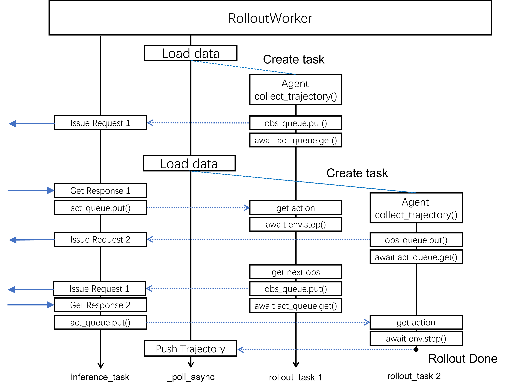

# Rollout Worker



The rollout worker runs these jobs in independent asyncio coroutines:

- **Load and execute trajectories**: Load a new prompt and run
  `agent.collect_trajectory()`. The agent steps through the environment, pushes new
  observations into `obs_queue`, and waits for new actions from `act_queue`. The user
  can provide customized implementation for the agent.

- **Process inference requests**: Handle requests produced by agents and obtained from
  `obs_queue`. After inference completes, it sends actions via `act_queue` back to the
  agent to continue the rollout.

- **Submit completed trajectories**: Push complete trajectories to the trainer.

For each agent, the timeline is straightforward: it iteratively puts the latest
observation into `obs_queue`, waits for an action from `act_queue`, and runs `env.step`
to get the next observation until a full trajectory is collected. The rollout worker
runs many agents concurrently, switching between them when some are idle and waiting for
remote responses.

The rollout worker typically doesn't perform actual computation—it serves as a client
for both the generation server and the environment service.

```{note}
Although we expect `EnvironmentService` to be a remote service, it can be implemented as a pure python function. In this case, the rollout worker process will handle the computation for `env.step`.
```
