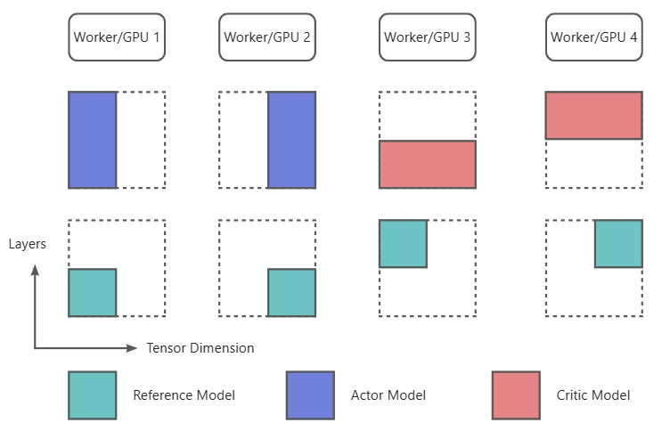

# Allocation & Parallelism

## GPU Allocation

GPU allocation is controlled by the `allocation_mode` CLI parameter. The most common
pattern looks like `"sglang.d2t2p1+d1t4p1"`, which means:

- The first 4 GPUs are allocated to SGLang for inference with:
  - 2-way tensor parallelism
  - 2-way data parallelism
- The remaining GPUs are allocated for training with 4-way tensor parallelism

## Parallelism Strategies

### Training

AReaL supports three parallelism strategies for dense models, similar to Megatron:

- Data Parallelism: Uses Megatron's DistributedDataParallel with AReaL's balanced DP
  partitioning algorithm (`SequenceSample.split`)
- Tensor Parallelism: Fully replicates Megatron's `ColumnParallelLinear` and
  `RowParallelLinear`
- Pipeline Parallelism: Developed in-house with 1F1B scheduling (planned to be replaced
  with an open-source implementation due to maintenance challenges)

### Inference

AReaL supports SGLang inference with intra-node tensor parallelism and customized data
parallelism.

### Parameter Partitioning

Each model worker holds multiple model shards based on the allocation configuration.

Example: With 4 GPUs configured as:

- Actor model: First half GPUs with tensor parallelism
- Critic model: Second half GPUs with pipeline parallelism
- Reference model: All GPUs with tensor and pipeline parallelism

The parameter distribution would be:



## Torch NCCL Communication Groups

During experiments, the following NCCL communication groups are created:

1. Global group: Includes all experiment GPUs (created in `global_comm.py`)
1. Parallelism Group: 3D parallel communication groups for a specific model (may match
   global group or be a subset, created in `topology.py`)
1. Data transfer groups: Groups between all data-parallel processes of any two models
   for data transfer (created in `data_manager.py`)

## Parallelism Ranks

Each model worker has a unique GPU index, but may have different parallel strategy
coordinates under different model names (actor, critic, etc.).

Example: GPU 2 might have:

- TP rank 1 for actor model
- TP rank 0 for reference model

Parallel strategy coordinates are maintained in `realhf.base.constants` and accessed
via:

```bash
with constants.model_scope(ModelName("actor", 0)):
    dp_rank1 = constants.data_parallel_rank()
with constants.model_scope(ModelName("ref", 0)):
    dp_rank2 = constants.data_parallel_rank()
```

Note: Interface and backend methods are automatically called within a model scope, so
the context manager can be omitted in those implementations.
