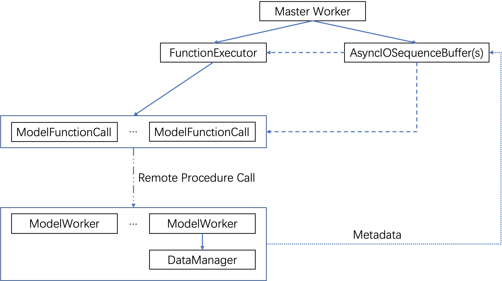
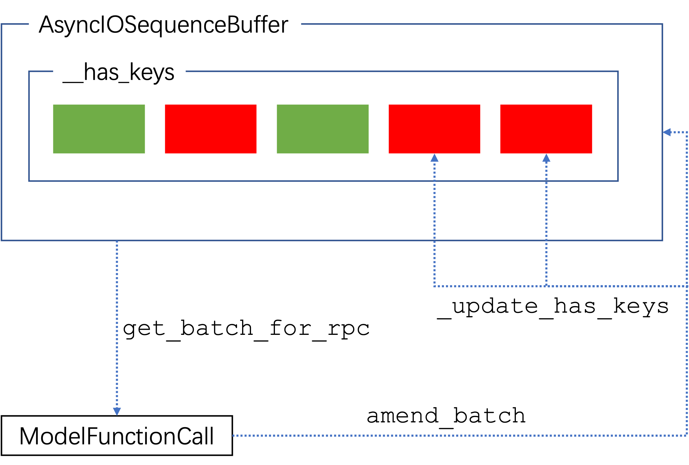

# Master Worker

## Overview



The trainer part of AReaL consists of a single master worker coordinating multiple model
workers.

An RL algorithm typically contains several model function calls (MFCs) that need to be
executed in a certain order. For example in (synchronous) PPO,

1. `actor_gen` generates responses given a batch of user prompts;
1. `ref_inf` computes the log-probabilities of the tokens under the reference policy;
1. `rew_inf` computes the rewards of the responses;
1. `actor_train` updates the policy with the PPO learning objective.

Here model function calls 2 and 3 depends on the output of 1. Model function call 4
depends on the outputs of 1, 2, and 3.

```{note}
The `actor_gen` and `rew_inf` MFC are eliminated for asynchronous RL and executed on the rollout side in a streaming manner.

The master worker will only see consequent MFCs. The results of previous MFCs will be loaded from the `StreamDataset`.
```

The MFCs are coordinated by a `FunctionExecutor` instance. It creates a
`ModelFunctionCall` instance for each MFC. The actual computation is performed on model
workers via remote procedure call.

## Buffer and MFC Execution Order



The master worker creates a `AsyncIOSequenceBuffer`, which is referenced by the
`FunctionExecutor` and the `ModelFunctionCall`'s. The buffer is responsible for managing
(meta)data and deciding the execution order of the MFCs.

Each datapoint can be seen as a `dict` of tensors. For example, the keys may include
`packed_prompts` and `task_ids`. Recall that some MFC may rely on the output of another.
For example in PPO, the MFC `ref_inf` requires `packed_input_ids`, which is not
presented initially. Instead, `packed_input_ids` appears as one of the results of the
MFC `actor_gen`.

The buffer keeps track of the available keys of each datapoint. Each
`ModelFunctionCall`instance obtains its next batch via `self.get_batch_for_rpc`, which
waits for enough datapoints with all the required keys. This means that it would not
start execution until all required keys are ready. After a model function call
execution, it calls `self.amend_batch` and updates the corresponding datapoints with new
keys.

While some keys are the results of MFCs, some are loaded from the dataset via
`FunctionExecutor.load_data`. Also note that instead of the actual data, the buffer
stores only metadata (data indices, keys, etc.) to reduce the cost of data transfer.
