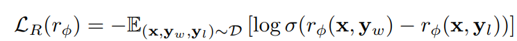
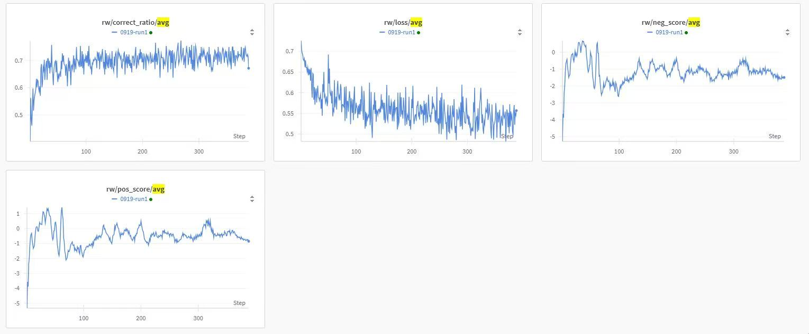
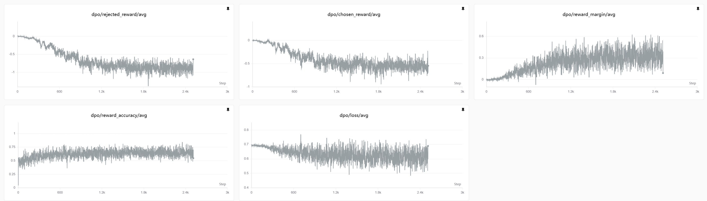

# Alignment with HHRLHF Dataset

This folder contains examples of **reward model (RM) training** and **Direct Preference
Optimization (DPO) training** on the `Anthropic/hh-rlhf` dataset. Both approaches
consume the same chosen/rejected preference pairs but differ in how they use the
preference signal.

| Method | Output                      | Use Case                                        |
| ------ | --------------------------- | ----------------------------------------------- |
| RM     | A scalar reward model       | Scores responses; used as reward in PPO/GRPO/RL |
| DPO    | A preference-aligned policy | Directly aligned model, no separate RM needed   |

______________________________________________________________________

## Reward Model Training

### What is Reward Model Training?

Reward modeling is a crucial step in aligning language models with human preferences.
The goal is to train a model that scores responses based on human preferences, which can
then guide policy optimization in reinforcement learning.

The Bradley-Terry reward modeling loss can be expressed as



### Quick Start

Launch the reward model training process using the provided configuration.

```bash
python3 examples/alignment/hhrlhf_rw.py \
    --config examples/alignment/hhrlhf_rw.yaml \
    experiment_name=hhrlhf-rw \
    trial_name=trial1 \
    actor.path=Qwen/Qwen2.5-7B \
    train_dataset.path=Anthropic/hh-rlhf \
    valid_dataset.path=Anthropic/hh-rlhf \
    scheduler.type=local \
    stats_logger.wandb.mode=online # Set to 'disabled' if you don't use Weights & Biases
```

### Training Curves



______________________________________________________________________

## Direct Preference Optimization (DPO)

### What is DPO?

Direct Preference Optimization (Rafailov et al., 2023) aligns a language model to human
preferences **without** training a separate reward model. Instead, it directly optimizes
the policy to assign higher probability to human-preferred (`chosen`) responses than to
rejected (`rejected`) ones, using a closed-form contrastive loss on log-probability
ratios between the trainable policy and a frozen reference model.

The DPO loss is defined as

$$ \\mathcal{L}_{\\mathrm{DPO}}(\\pi_\\theta; \\pi\_{\\mathrm{ref}}) = -\\mathbb{E}_{(x,
y_w, y_l) \\sim \\mathcal{D}} \\left\[ \\log \\sigma!\\left( \\beta \\log
\\frac{\\pi_\\theta(y_w \\mid x)}{\\pi\_{\\mathrm{ref}}(y_w \\mid x)}

- \\beta \\log \\frac{\\pi\_\\theta(y_l \\mid x)}{\\pi\_{\\mathrm{ref}}(y_l \\mid x)}
  \\right) \\right\] $$

where $\\pi\_\\theta$ is the trainable policy, $\\pi\_{\\mathrm{ref}}$ is the frozen
reference model, $y_w$ and $y_l$ are the chosen and rejected responses, $\\beta$
controls how strongly the policy is allowed to deviate from the reference (larger
$\\beta$ → tighter KL constraint), and $\\sigma$ is the sigmoid function.

AReaL's DPO implementation computes $\\pi\_{\\mathrm{ref}}$ log-probabilities **online**
each step via a colocated reference engine (configured under the `ref:` field in YAML),
mirroring the ref-model pattern used by PPO and GRPO. No pre-computed reference logprobs
need to be stored on disk.

### Quick Start

```bash
python3 examples/alignment/hhrlhf_dpo.py \
    --config examples/alignment/hhrlhf_dpo.yaml \
    experiment_name=hhrlhf-dpo \
    trial_name=trial1 \
    actor.path=Qwen/Qwen2.5-7B \
    ref.path=Qwen/Qwen2.5-7B \
    train_dataset.path=Anthropic/hh-rlhf \
    valid_dataset.path=Anthropic/hh-rlhf \
    scheduler.type=local \
    stats_logger.wandb.mode=online # Set to 'disabled' if you don't use Weights & Biases
```

Supported `loss_type` values: `sigmoid` (original DPO, Rafailov et al. 2023) and `ipo`
(Azar et al. 2023, per-token-averaged squared-loss variant).

For best alignment quality, the recommended pipeline is **Base → SFT → DPO**, using the
SFT checkpoint for both the actor and the reference model. The example above trains DPO
directly from the base model to keep the verification setup minimal.

### Training Curves

Training Qwen2.5-7B-Base on `Anthropic/hh-rlhf` for one epoch (no SFT warmup) reproduces
the canonical DPO signature from the original paper: `loss` starts near $\\log 2
\\approx 0.693$ and decreases, `reward_accuracy` rises from 0.50 to ~0.70,
`reward_margin` grows monotonically, and `rejected_reward` decreases faster than
`chosen_reward`.


