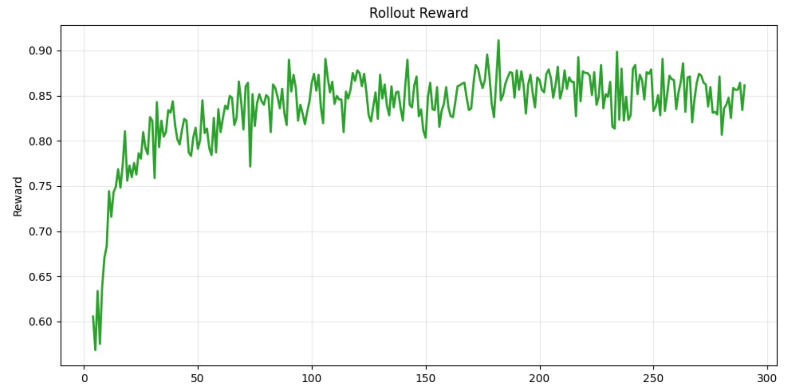

# On-Policy Distillation

## Overview 

On-policy distillation trains the student using teacher guidance on trajectories sampled from its own policy, reducing distribution mismatch and improving stability. Combined with reinforcement learning, it lets the student **imitate the teacher while exploring simultaneously**.

**AReaL** previously supported RL for post-training. With this implementation, it now also supports **on-policy knowledge distillation** and the **combined KDRL framework**, enabling the student to learn from a teacher while exploring via RL on the same on-policy trajectories, improving both efficiency and stability.

## The Core Concept

Knowledge distillation aims to train the student policy $\pi_\theta$ to mimic the behavior of a more powerful teacher $\pi_T$. The choice of divergence measure and sampling distribution significantly impacts the student's final performance and exposure bias.

### Supervised Fine-Tuning (Forward KL):

A simple yet effective method is to maximize the log-likelihood on data generated by the teacher, known as supervised fine-tuning (SFT). This is equivalent to minimizing the Forward KL divergence between $\pi_T$ and $\pi_\theta$:
$$\arg \min_{\theta} D_{KL}(\pi_T \parallel \pi_\theta) = \arg \max_{\theta} \mathbb{E}_{q \sim Q, o \sim \pi_T(\cdot|q)} [\log \pi_\theta(o|q)]$$


### On-Policy Distillation (Reverse KL):

While SFT is efficient, training on off-policy data induces exposure bias: a mismatch between training on teacher-generated prefixes and inference on self-generated prefixes. This is especially severe for reasoning LLMs with long response chains. To alleviate this, we can train on self-generated trajectories, which is equivalent to minimizing the Reverse KL divergence (RKL) [1]:
$$\arg \min_{\theta} D_{KL}(\pi_\theta \parallel \pi_T) = \arg \max_{\theta} \mathbb{E}_{q \sim Q, o \sim \pi_\theta(\cdot|q)} \left[ \log \frac{\pi_T(o|q)}{\pi_\theta(o|q)} \right]$$

Minimizing RKL is equivalent to REINFORCE where the "reward" is the log-ratio of teacher to student probabilities. By adopting the GRPO framework, we optimize [1]:

$$J_{RKL}(\theta) = \mathbb{E}_{q, \{o_i\} \sim \pi_{\theta_{old}}} \left[ \frac{1}{G} \sum_{i=1}^G \frac{1}{|o_i|} \sum_{t=1}^{|o_i|} \frac{\pi_\theta(o_{i,t})}{\pi_{\theta_{old}}(o_{i,t})} R_{i,t} \right]$$

where the reward $R_{i,t} = \log \pi_T(o_{i,t}) - \log \pi_\theta(o_{i,t})$. This encourages the student to increase the probability of tokens the teacher prefers and suppress those it deems unlikely.

- Implementation Detail:
During pure KD, we need to set `rl_loss_weight` to 0, so the implementation estimates the RKL gradient using importance sampling. The code calculates the reward as teacher_logp - logprobs ($R_{i,t}$) and applies a negative coefficient to the loss to perform minimization (check `areal/trainer/ppo/actor.py`).


### Combination of GRPO and KD
We implemented KD+RL approach using a Joint Loss strategy.

#### Joint Loss: 
This strategy augments the GRPO objective with an auxiliary KL loss term. To maintain consistency with the on-policy nature of GRPO, it utilizes the Reverse KL (RKL) [1]:
$$J_{KDRL}(\theta) = J_{GRPO}(\theta) - \beta D_{KL}(\pi_\theta \parallel \pi_T) \tag{8}$$

The gradient $\nabla_\theta J_{KDRL}(\theta)$ provides an unbiased estimate of $\nabla_\theta J_{GRPO}( \theta) + \beta \cdot \nabla_\theta J_{RKL}(\theta)$.

- Implementation Detail: In the joint loss case (`rl_loss_weight` > 0), the RKL is treated as a direct penalty. Minimizing the term `logprobs - teacher_logp` is mathematically equivalent to minimizing the Reverse KL objective $D_{KL}(\pi_\theta \parallel \pi_T)$ when sampling from the student distribution $\pi_\theta$. In the code, this is implemented as:
`loss = rl_loss_weight * loss + distill_loss_weight * teacher_kl`


## Running the example 

Need to add teacher configuration to your yaml:

```yaml
teacher:
  allocation_mode: d1p1t4
  rl_loss_weight: 1.0
  distill_loss_weight: 0.005
  experiment_name: ${experiment_name}
  trial_name: ${trial_name}
  path: Qwen/Qwen3-32B
  init_from_scratch: false
  disable_dropout: true
  dtype: ${actor.dtype}
  mb_spec:
    max_tokens_per_mb: 10240
  optimizer: null
  scheduling_spec: ${actor.scheduling_spec}
```

```bash
python3 examples/math/gsm8k_rl.py --config examples/distillation/gsm8k_grpo_distill.yaml scheduler.type=local experiment_name=gsm8k-grpo-distillation trial_name=trial0
```

## Result

On-policy knowledge distillation + RL reward plot for Qwen2.5-14B-Instruct (teacher) and Qwen3-0.6B (student), trained using FSDP and vLLM.



## References

[1] Xu H, Zhu Q, Deng H, Li J, Hou L, Wang Y, Shang L, Xu R, Mi F. Kdrl: Post-training reasoning llms via unified knowledge distillation and reinforcement learning. [KDRL paper link](https://arxiv.org/pdf/2506.02208)