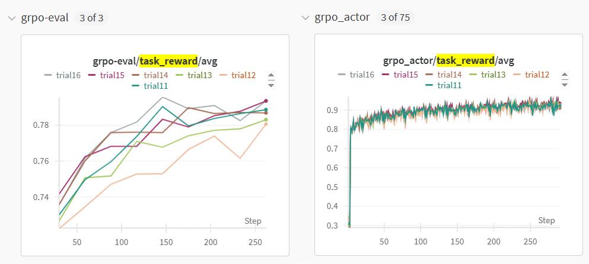

## Hyper-parameters for GSM8K Finetuning on Qwen2.5-1.5b-Instruct

The hyperparameters given in gsm8k_grpo.yaml is the set that we found to achieve the highest max `grpo-eval/task_reward/avg` during training for `Qwen2.5-1.5b-Instruct`. You are free to try out more of the hyperparameters listed below!

| lr         | weight decay | batchsize | max task_reward |
|------------|-------------|-----------|---------|
| 1.70E-05   | 0.017       | 4         | **0.79570** |
| 1.30E-05   | 0.015       | 8         | 0.79355 |
| 1.50E-05   | 0.01        | 4         | 0.79043 |
| 1.50E-05   | 0.02        | 4         | 0.78984 |
| 1.00E-05   | 0.02        | 4         | 0.78311 |
| 1.00E-05   | 0.01        | 8         | 0.78066 |

See also the training curve run on 8 Nvidia L20Y GPUs:

The experiments are run in lcoal mode, using `Adam` optimizer and `10` training epochs. It takes around *35 minutes* for an experiment with batchsize 4, and *65 minutes* for batchsize 8.
