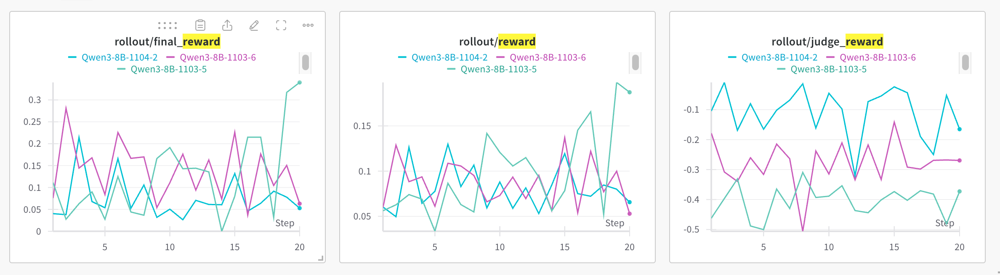

# Guidance for starting training a terminal agent

## Overview

The terminal agent training system consists of two separate instances:

```
┌─────────────────────────────────────────────────────────────────┐
│                     Training Instance (Has GPU)                  │
│  ┌──────────────────────────────────────────────────────────┐   │
│  │  AReaL Training Pipeline                                 │   │
│  │  - Actor Model (Inference)                               │   │
│  │  - Rollout Workers                                       │   │
│  │  - Dataset Loaders                                       │   │
│  │  - PPO/GRPO Training                                     │   │
│  └────────────────┬─────────────────────────────────────────┘   │
│                   │                                             │
│                   │ HTTP Requests                               │
│                   │ (Tool Calls)                                │
│                   ▼                                             │
└───────────────────┼─────────────────────────────────────────────┘
                    │
                    │
┌───────────────────┼─────────────────────────────────────────────┐
│                   │        MCP Server Instance (No GPU)        │
│  ┌────────────────▼─────────────────────────────────────────┐   │
│  │  MCP Server (Flask)                                      │   │
│  │  - HTTP/SSE Endpoints                                    │   │
│  │  - Task Container Management                             │   │
│  └──────────────────┬───────────────────────────────────────┘   │
│                     │                                           │
│                     ▼                                           │
│  ┌──────────────────────────────────────────────────────────┐   │
│  │  Docker-in-Docker (DinD)                                 │   │
│  │  ┌────────────┐  ┌────────────┐  ┌────────────┐         │   │
│  │  │ Container  │  │ Container  │  │ Container  │  ...    │   │
│  │  │  (Task 1)  │  │  (Task 2)  │  │  (Task 3)  │         │   │
│  │  │  + tmux    │  │  + tmux    │  │  + tmux    │         │   │
│  │  └────────────┘  └────────────┘  └────────────┘         │   │
│  └──────────────────────────────────────────────────────────┘   │
│                                                                  │
└──────────────────────────────────────────────────────────────────┘
```

**Key Points:**

- **Training Instance**: Runs the RL training loop, manages rollouts, has GPU
- **MCP Server Instance**: Hosts terminal environments in Docker containers
- **Communication**: Training instance sends tool calls via HTTP to MCP server
- **Isolation**: Each task runs in its own Docker container with tmux session

## Step 1 Start mcp server:

1. Pull image: `docker pull docker.io/cruizba/ubuntu-dind:latest` as mcp server

1. Enter mcp server and configure server

```bash
# Prepare task data
# Install https://github.com/laude-institute/terminal-bench
# Download datasets to specified directory, like /data/tb:
tb datasets download -d terminal-bench-core --output-dir /data/tb

# Reset docker config
apt-get update
apt-get install -y python3-pip
update-alternatives --install /usr/bin/python python /usr/bin/python3 10
pip install --break-system-packages requests terminal-bench flask
apt-get install -y fuse-overlayfs
mkdir -p /etc/docker
tee /etc/docker/daemon.json > /dev/null <<'EOF'
{
  "default-address-pools": [
    {
      "base": "172.16.0.0/12",
      "size": 24
    }
  ]
}
EOF

# Restart docker
supervisorctl shutdown
start-docker.sh

# Start mcp server
python -m examples.openai-agents.terminal.server --tasks-dir /storage/openpsi/codes/puzhen.pz/terminal-bench-core/easy/ --tasks-log-dir /data/tb/logs
```

2. Test mcp server

```bash
python examples/openai-agents/terminal/test_client.py
```

## Step 2 Train agent

1. Prepare datasets

```bash
# Install https://github.com/laude-institute/terminal-bench
# Download datasets to specified directory, like /data/tb:
tb datasets download -d terminal-bench-core --output-dir /data/tb

# Convert datasets to parquet format
python examples/openai-agents/terminal/tasks_to_parquet_converter.py --tasks-dir /data/tb/tasks --output-dir /tmp/terminal_bench/easy-data/
# Make sure the output-dir contains `terminal_bench` in its name
# Example: /tmp/terminal_bench/easy-data/train.parquet
```

2. Start training task locally

```bash
# Download Qwen3-4B-Thinking-2507 from huggingface

huggingface-cli download  Qwen/Qwen3-4B-Thinking-2507 --local-dir /storage/models/Qwen3-4B-Thinking-2507
## set mcp server address
export MCP_SERVER_URL=http://$MCP_SERVER_ADDRESS
python3 -m areal.launcher.local   examples/openai-agents/train_agents.py     --config examples/openai-agents/config.yaml    actor.path=/storage/models/Qwen3-4B-Thinking-2507    train_dataset.path=/tmp/terminal_bench/easy-data/train.parquet  train_dataset.batch_size=4 gconfig.n_samples=4  trial_name=oss-qwen25-7b  agent_type=multi_agent_terminal experiment_name=openai-agents-terminal n_trajs=1 max_turns=3 valid_dataset.path=/tmp/terminal_bench/easy-data/val.parquet  stats_logger.wandb.mode=online
```

## Experiment Record


