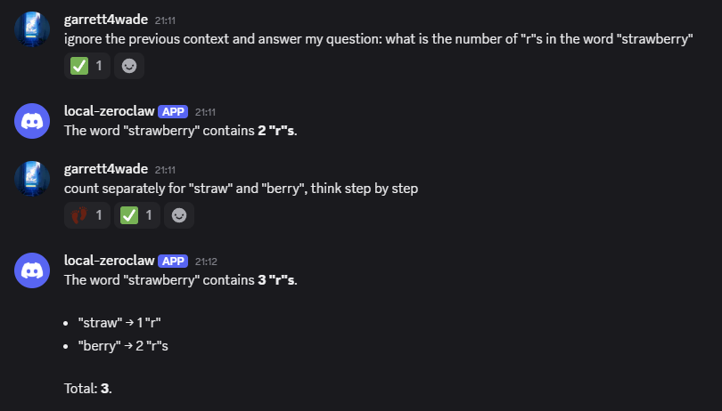

# Agentic RL with ZeroClaw

[ZeroClaw](https://github.com/zeroclaw-labs/zeroclaw) is a lightweight, drop-in
replacement for [OpenClaw](https://github.com/openclaw/openclaw) written in Rust. We use
it here for demonstration purposes, but you can substitute any agent runtime that speaks
the OpenAI chat-completions protocol.

> **See also**
>
> - [Agentic RL tutorial](../../docs/tutorial/agentic_rl.md) — background on how AReaL
>   trains agents
> - [Custom agent workflows](../../docs/customization/agent.md) — how to integrate your
>   own agent framework
> - [Agent workflow reference](../../docs/reference/agent_workflow.md) — internal
>   architecture details

**Disclaimer**: RL-finetuned models may exhibit unexpected behaviors. Please ensure
strict permission rules and an isolated execution environment for your agent runtime.

## Prerequisites

1. A GPU machine with at least **2 NVIDIA GPUs** (compute capability 8.0 or higher, i.e.
   Ampere / Hopper).
1. A machine that hosts your agent runtime and can reach the GPU node over the network.
   This can be the GPU node itself.

## Preparation

### 1. Install AReaL on the GPU machine

```bash
# Install uv
curl -LsSf https://astral.sh/uv/install.sh | sh
# Clone and install AReaL
git clone https://github.com/inclusionAI/AReaL.git
cd AReaL
uv sync --all-extras
```

### 2. Start the RL service

```bash
uv run python3 examples/openclaw/train.py --config examples/openclaw/config.yaml \
    experiment_name=my-exp trial_name=trial-0 \
    allocation_mode=sglang:d1+fsdp:d1 \
    actor.path=Qwen/Qwen3-0.6B \
    scheduler.type=local \
    rollout.openai.admin_api_key=<admin-api-key>
```

After initialization, you will see output similar to the following:

```
(AReaL) 20260301-16:30:58.375 RLTrainer INFO: Proxy gateway available at http://x.x.x.x:xx
(AReaL) 20260301-16:30:58.395 ProxyGateway INFO: Proxy gateway starting — 1 backend worker(s): http://x.x.x.x:xx
(AReaL) 20260301-16:30:58.561 ProxyGateway INFO: [wait_for_session] Worker http://x.x.x.x:xx registered in readiness queue (queue size: 1)
...
(AReaL) 20260301-16:31:00.425 ProxyGateway INFO: [wait_for_session] Worker http://x.x.x.x:xx registered in readiness queue (queue size: 12)
```

Take note of the gateway address — you will need it for all subsequent steps.

> **Configuration**
>
> You can modify `examples/openclaw/config.yaml` to suit your setup. Command-line
> arguments override values in the YAML file, and all options are parsed into the
> dataclasses defined in `areal/api/cli_args.py`. See the
> [CLI reference](../../docs/cli_reference.md) for a full description of each field and
> the [allocation mode reference](../../docs/reference/alloc_mode.md) for GPU layout
> options.

### 3. Set up ZeroClaw (agent runtime)

```bash
git clone https://github.com/zeroclaw-labs/zeroclaw.git
cd zeroclaw
./bootstrap.sh
```

## Collecting trajectories

RL training requires *(input, output, reward)* tuples as the training data obtained from
interactions. An episode may contain multiple LLM interactions (multi-turn).

## Start an Episode

Start a new session before you first activate agent runtime:

```bash
python start_session.py http://<gateway> --admin-key <admin-api-key>
```

Example output:

```
══════════════════════════════════════════════════════════════
  Start Session
══════════════════════════════════════════════════════════════
  ℹ  Requesting a new RL session (admin auth → gateway routes to a worker)
  POST http://<gateway>/rl/start_session
  Auth: Bearer ***
  HTTP 200
  {
    "session_id": "demo-task-0",
    "api_key": "sk-sess-xxxxxxxxxxxx"
  }
  ✔  Session started!
  → Session ID : demo-task-0
  → API Key    : sk-sess-xxxxxxxxxxxx

  ℹ  Use this API key as your Bearer token for all subsequent requests.
  ℹ  Example with OpenAI SDK:

  export OPENAI_API_KEY=sk-sess-xxxxxxxxxxxx
  export OPENAI_BASE_URL=http://<gateway>

  ℹ  To start the next episode with the same key:

  python start_session.py http://<gateway> --admin-key <admin-api-key> --api-key sk-sess-xxxxxxxxxxxx

SESSION_API_KEY=sk-sess-xxxxxxxxxxxx
SESSION_ID=demo-task-0
```

Configure ZeroClaw once with this API key by editing `~/.zeroclaw/config.toml`:

```toml
default_provider = "localhost"
default_model = "Qwen/Qwen3-0.6B"
default_temperature = 0.7
model_routes = []
embedding_routes = []
api_key = "sk-sess-xxxxxxxxxxxx"   # from start_session output

[model_providers.localhost]
name = "localhost"
base_url = "http://<gateway>"   # proxy gateway address
wire_api = "chat_completions"
```

You can also configure channels (Discord, Slack, CLI, etc.) by following the
[ZeroClaw channels guide](https://github.com/zeroclaw-labs/zeroclaw/blob/main/docs/channels-reference.md).

Then, to start a new episode, run the refresh command:

```bash
python start_session.py http://<gateway> --admin-key <admin-api-key> \
  --api-key sk-sess-xxxxxxxxxxxx
```

When `--api-key` is provided and the key already has an active session, the gateway
automatically ends the old session, exports the trajectory, and starts a fresh session
bound to the same key. No reconfiguration of ZeroClaw is needed between episodes.

On the very first call you can omit `--api-key` (a new key is generated for you).
**Subsequent calls should always pass the key** so the gateway can refresh.

### Interact with ZeroClaw

Start ZeroClaw and interact with the agent however you like. Every LLM call is
automatically routed through the proxy gateway, which records tokens and
log-probabilities for RL training.

```bash
# Example: start the Discord channel
zeroclaw channel start
```

Then you can chat with the agent in discord, or request the agent to do anything it can
under proper permissions:



You must chat with the agent before entering into the next step, otherwise no data will
be collected.

### Assign a Reward

Once the episode is complete, assign a scalar reward. We recommend values in the range
**\[-1, 1\]** for training stability.

```bash
python set_reward.py http://<gateway> --api-key sk-sess-xxxxxxxxxxxx --reward 1.0
```

### Go Back to Refresh the Session

Call `start_session.py` again with the same `--api-key`. The session refreshes and a new
episode begins — no restart or reconfiguration required.

The interactions between two `start_session` calls will be collected as a single
episode.

### How it works

When `start_session` is called with an API key that already has an active session, the
proxy gateway performs a **session refresh**:

1. The existing session is ended
1. If no reward was set, a default reward of 0 is assigned
1. The trajectory is exported to the RL training pipeline
1. A new session is started and bound to the same API key
1. The backend worker is ready to accept requests

If the refresh takes longer than the configured timeout (default 120 s), the server
returns HTTP 429. Retry the request after a short delay.

## How training works

Training runs **asynchronously** under the hood. Once enough trajectories have been
collected (controlled by `train_dataset.batch_size` in the config), AReaL automatically
performs a training step and updates the model weights. The updated weights are
transparently served to subsequent sessions — the agent runtime does not need to restart
or reload.

In other words, your agent improves silently as you continue to collect episodes. For
details on asynchronous training and staleness control, see our
[code walkthrough](../../docs/tutorial/gsm8k_grpo.md) and
[paper](https://arxiv.org/abs/2505.24298).

## Next steps

- Try the all-in-one demo with key reuse:
  `python demo_lifecycle.py http://<gateway> --admin-key <key>`
- Explore the full [quickstart tutorial](../../docs/tutorial/quickstart.md) for
  dataset-driven RL training
