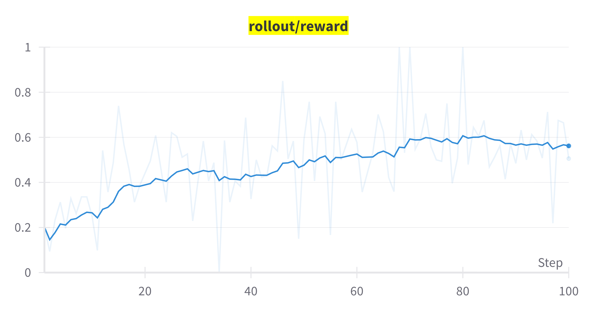

# Customer Service Agent Training with Tau2 Benchmark

## Overview

This example demonstrates how to train customer service agents using the [$\tau^2$-Bench](https://github.com/sierra-research/tau2-bench) with AReaL's PPO/GRPO training pipeline. The $\tau^2$-Bench provides realistic customer service simulation environments across multiple domains (retail, airline, telecom) where agents must help with user's request by both using agent tools and guiding users using their tools.

## Code Architecture

The code is modified from the [proxy](../experimental/proxy/README.md) example so that the training workflow (`tau2_train.py`) and the agent runner script (`tau2_agent.py`) can be decoupled, with common utilities in `tau2_utils.py`.

* `tau2_train.py`: 
* `tau2_agent.py`: Reuse the orchestrator, agent and user simulator from the tau2-bench package to build the runner.

## Running the Example

### Prerequisites

Please make sure AReaL is setup and working following the [installation guide](https://inclusionai.github.io/AReaL/tutorial/installation.html).

1. Install the (forked) tau2-bench package:
```bash
pip install git+https://github.com/dhh1995/tau2-bench.git@dhh/async-and-custom-completion
```
Note that the training relies on the async version of the agent and user simulator in the tau2-bench package. These changes will be merged into the [original tau2-bench repository](https://github.com/sierra-research/tau2-bench) later.

2. setup TAU2_DATA_DIR environment variable.
```bash
export TAU2_DATA_DIR=/path/to/tau2-bench/data
```

### Basic Training Command

1. Prepare the user simulator server.

You need to first setup a user simulator server if using self-hosted LLMs. For example when [using Qwen with SGLang](https://qwen.readthedocs.io/en/latest/deployment/sglang.html):
```bash
python3 -m sglang.launch_server --model-path Qwen/Qwen3-32B --host 0.0.0.0 --tool-call-parser qwen25 --chat-template ./qwen3_nonthinking.jinja --dp-size 8
```

Below we assume the hosted address is http://0.0.0.0:30000/v1/.

2. Run the training.

In this example, we use a `small` subset of the tau2-telecom domain, which contains 20 tasks where each task only contains one subtask.

```bash
python3 -m areal.launcher.ray examples/tau2/tau2_train.py \
    --config examples/tau2/config.yaml \
    experiment_name=tau2-grpo \
    trial_name=trial0 \
    cluster.n_nodes=3 \
    cluster.n_gpus_per_node=8 \
    allocation_mode=sglang:d16+megatron:d2p4 \
    gconfig.n_samples=16 \
    actor.path=Qwen/Qwen2.5-7B-Instruct \
    econfig.domain=telecom \
    econfig.max_steps=30 \
    train_dataset.path=tau2/small \
    train_dataset.batch_size=8 \
    user_llm_base_url=http://0.0.0.0:30000/v1/
```

It uses 2 nodes for rollout, 1 node for training and 1 node for user simulator.
The training data batch size is 8 and group size is 16, resulting in 128 rollouts per step.

### Curve

The rollout reward for the training tasks are shown below.



For the above example configuration, it usually takes about less than 10 minutes in average (depending on the hardware) for one step.

## Notes

1. When using litellm with multiprocessing, the `Queue bound to different event loop` error may occur. See also: [litellm issue #17813](https://github.com/BerriAI/litellm/issues/17813). This will not stop the training, but will make the outputs hard to read. You may use `grep -aivE "loop|queue|\^|asyncio|litellm"` to filter out the error messages before this issue is fixed.
2. The trajectories will be dumped as `json` and `txt` files in the `generated/` directory. You may read and analyze the trajectories as your need.
