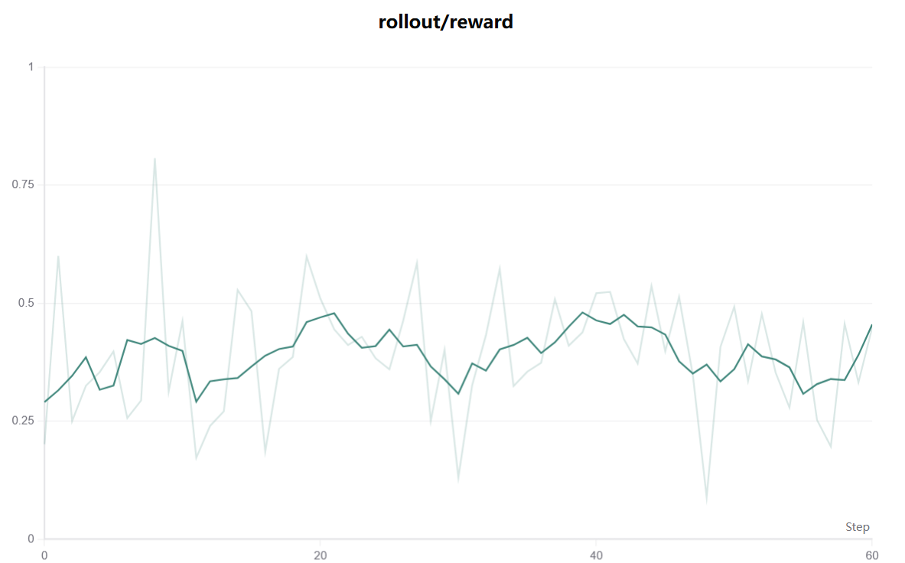

# Terminal Agent Training with Terminal Bench 1.0

## Overview

This example demonstrates how to train terminal agents with AReaL's PPO/GRPO-style
training pipeline on Terminal Bench tasks.

It is an AReaL adaptation of the training workflow originally developed in
[SETA](https://github.com/camel-ai/seta), with the environment management and rollout
loop refactored into an AReaL example. In this example, we focus on an easy subset of
Terminal Bench 1.0 derived from the SETA conversion of Terminal Bench tasks.

[Terminal Bench](https://github.com/harbor-framework/terminal-bench) is a benchmark for
evaluating AI agents in real terminal environments. It provides a task dataset plus an
execution harness, where each task includes a natural language instruction, a runnable
environment, and outcome-based verification. This example targets the Terminal Bench 1.0
style workflow used in SETA and trains on the easy subset prepared for that pipeline.

## Relation to SETA

This directory is not a copy of SETA. It is a conversion of the Terminal Bench training
path in SETA into AReaL's workflow abstraction and launcher model.

Compared with SETA:

- updated to work with the current AReaL stack (`v1.0.2`)
- supports single-controller mode through AReaL's `PPOTrainer`
- rollout logic is implemented as an AReaL `RolloutWorkflow`
- the CAMEL-based terminal agent is packaged as an example-local agent module
- Terminal Bench task environments are still created and verified through
  `terminal_bench`

## Code Architecture

- `train.py`: Entry point that loads config, builds the dataset, and launches AReaL
  training.
- `workflow/camel_rlvr_workflow.py`: Rollout workflow that builds task images, runs
  trajectories, collects rewards, and exports interactions.
- `workflow/pre_build_tasks_utils.py`: Helper for pre-building Terminal Bench task
  images before rollout.
- `agent/camel_terminal_agent.py`: CAMEL-based terminal agent wrapper used for each
  trajectory.
- `agent/chat_agent_trace.py`: Traced `ChatAgent` variant used by the agent.
- `agent/prompts.py`: Developer-agent prompt construction.
- `agent_rl_config.py`: Example-specific config extensions on top of AReaL `GRPOConfig`.

## Included Configurations

Two example configs are currently included:

| Config                    | Backend | Cluster Target        | Use Case                      |
| ------------------------- | ------- | --------------------- | ----------------------------- |
| `config_tb_sglang.yaml`   | SGLang  | single-node GPU setup | local or small-scale training |
| `config_tb_vllm_npu.yaml` | vLLM    | Ascend NPU setup      | NPU training                  |

## Running the Example

### Prerequisites

Please make sure AReaL itself is already installed and working.

You will need:

- Python `>=3.10`
- a working AReaL environment
- Docker CLI available inside the AReaL runtime
- Docker Compose and Buildx available as Docker CLI plugins
- the `terminal_bench` Python package

For NPU usage, you will also need:

- Ascend drivers and runtime
- access to the required `/dev/davinci*` devices
- `sglang[srt_npu]`, since this workflow currently depends on SGLang tool parsing even
  when using the vLLM-based config

### Recommended Runtime Model

This example is intended to run inside the AReaL runtime, with host Docker mounted into
that runtime container.

That structure is important: Terminal Bench task environments are launched via
`docker compose`, and the `docker compose` invocation needs to happen from the same
AReaL runtime that is performing rollout and evaluation.

The recommended setup is:

- run AReaL inside a runtime container
- mount the host Docker socket into that container
- mount the Docker CLI and Docker CLI plugins into that container
- run this example from inside that AReaL runtime container

Minimum mounts:

```bash
-v /var/run/docker.sock:/var/run/docker.sock
-v /usr/bin/docker:/usr/bin/docker:ro
-v /usr/libexec/docker/cli-plugins:/usr/libexec/docker/cli-plugins:ro
```

### Install Example Dependencies

From the AReaL repo root:

```bash
cd examples/terminal_bench
pip install -e .
```

This installs the example-scoped dependencies declared in
[`pyproject.toml`](./pyproject.toml):

- `ipython`
- `ruamel.yaml`
- `streamlit`
- `sqlalchemy`
- `docker`
- `camel_ai`
- `terminal_bench`

If you are using the NPU / vLLM path, also install the optional extra:

```bash
pip install -e ".[npu]"
```

If `terminal_bench` fails to install because of an upstream Python-version constraint
mismatch, which can happen on some NPU runtime images, install it from source and relax
its Python requirement to `>=3.11`:

```bash
git clone https://github.com/harbor-framework/terminal-bench.git
cd terminal-bench
```

Edit `pyproject.toml`:

```toml
requires-python = ">=3.11"
```

Then install it manually:

```bash
pip install --no-deps -e .
```

If you use this fallback path, you can install the rest of the example dependencies
separately:

```bash
cd ../AReaL/examples/terminal_bench
pip install --no-deps -e .
pip install ipython ruamel.yaml streamlit sqlalchemy docker
```

### Manual Dependency Path

If you already manage some dependencies separately, you can use the same manual setup
pattern used in SETA.

Install CAMEL and Terminal Bench from a SETA checkout:

```bash
git clone https://github.com/camel-ai/seta.git
cd seta
git submodule update --init --recursive

cd external/camel
pip install --no-deps -e .

cd ../terminal-bench
pip install --no-deps -e .
```

Then install the remaining example dependencies:

```bash
pip install ipython ruamel.yaml streamlit sqlalchemy docker
```

### Install SGLang for NPU

One working installation path from the original setup is:

```bash
git clone -b v0.5.6.post2 https://github.com/sgl-project/sglang.git
cd sglang
mv python/pyproject_other.toml python/pyproject.toml
pip install -e python[srt_npu] --no-deps
```

### Configure `tiktoken`

This example assumes `o200k_base.tiktoken` is cached locally.

```bash
export TIKTOKEN_CACHE_DIR=/tmp/tiktoken-cache
mkdir -p "$TIKTOKEN_CACHE_DIR"
curl -k -o "$TIKTOKEN_CACHE_DIR/o200k_base.tiktoken" \
  https://openaipublic.blob.core.windows.net/encodings/o200k_base.tiktoken
```

If you need the hashed cache filename used by `tiktoken`, compute it with:

```bash
python3 - <<'PY'
import hashlib
url = "https://openaipublic.blob.core.windows.net/encodings/o200k_base.tiktoken"
print(hashlib.sha1(url.encode()).hexdigest())
PY
```

### Prepare the Dataset

This example does not work with the parquet file alone. The parquet rows point to task
assets that must also exist under `AReaL/dataset/`.

You should prepare the converted Terminal Bench dataset from either of these sources:

- SETA: https://github.com/camel-ai/seta
- terminal-bench-seta: https://github.com/ActuallyEdward/terminal-bench-seta

For this example, those two sources should be treated as equivalent dataset sources.

The configs in this directory expect the easy-subset parquet to be available at:

```bash
AReaL/dataset/tbench-tasks_convert/tbench-selected-tasks-easy.parquet
```

and they also expect the referenced task files and directories from the same converted
dataset to be present under `AReaL/dataset/`.

One workable setup is:

```bash
cd AReaL/dataset
git clone https://github.com/ActuallyEdward/terminal-bench-seta.git
```

The `train_filtered_easy.parquet` file is also provided in
[`terminal-bench-seta`](https://github.com/ActuallyEdward/terminal-bench-seta).

Then place or link the easy-subset parquet from that checkout at the path expected by
the configs:

```bash
mkdir -p AReaL/dataset/tbench-tasks_convert
cp AReaL/dataset/terminal-bench-seta/train_filtered_easy.parquet \
  AReaL/dataset/tbench-tasks_convert/tbench-selected-tasks-easy.parquet
```

If you source the data from SETA instead, use the same converted dataset layout and
place the parquet and referenced task assets under `AReaL/dataset/` in the same way.

### Docker Compose / Buildx

Docker Compose and Buildx should be available inside the AReaL runtime at:

```bash
/usr/libexec/docker/cli-plugins/
```

If needed:

```bash
chmod +x /usr/libexec/docker/cli-plugins/docker-compose
chmod +x /usr/libexec/docker/cli-plugins/docker-buildx
```

### Training Commands

The following commands are intended to be executed from the AReaL repo root.

#### SGLang

```bash
python3 examples/terminal_bench/train.py \
    --config examples/terminal_bench/config_tb_sglang.yaml
```

#### vLLM on NPU

```bash
python3 examples/terminal_bench/train.py \
    --config examples/terminal_bench/config_tb_vllm_npu.yaml
```

## Results

The following figure shows a representative training reward curve on the easy subset
derived from SETA:

<p align="left">
  
</p>

On this setup, we observe reward-curve behavior qualitatively similar to the GRPO
training trends reported in
[terminal-bench-rl](https://github.com/Danau5tin/terminal-bench-rl). This is a
directional comparison of training dynamics rather than a claim of identical setup,
identical scale, or identical leaderboard numbers.

## Notes

1. This example currently targets the easy subset used in the SETA conversion, not the
   full Terminal Bench task distribution.
1. `pyproject.toml` in this directory is intentionally example-scoped. It does not
   replace installing AReaL itself.
1. Docker, proxy, model-mount, and NPU device details are environment-specific and
   should be adapted locally.

## References

- SETA: https://github.com/camel-ai/seta
- Terminal Bench: https://github.com/harbor-framework/terminal-bench
- Terminal-Bench-RL: https://github.com/Danau5tin/terminal-bench-rl
