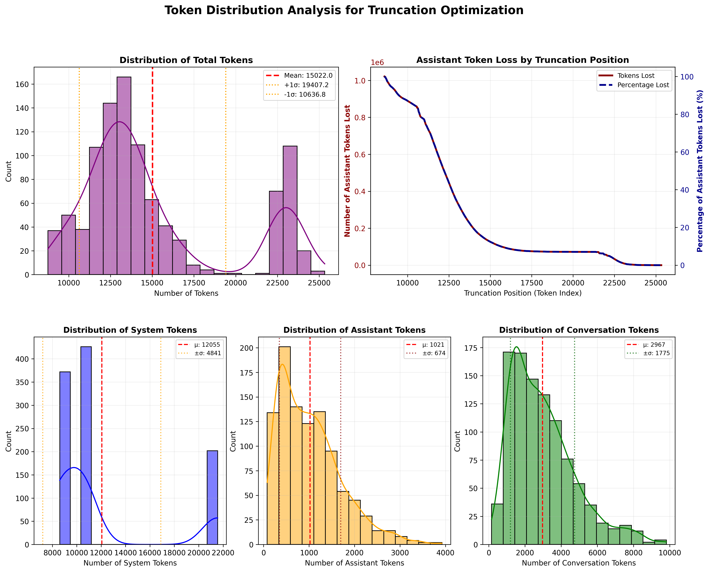

# Dataset Preparation for SFT Training

This guide explains how to prepare Supervised Fine-Tuning (SFT) datasets from Tau2 agent trajectories using the `prepare_dataset.py` script.

## Overview

The dataset preparation process involves two main steps:
1. **Extract SFT data** from Tau2 trajectory result files
2. **Convert to OpenAI format** for training with popular frameworks

## Quick Start

### Step 1: Create SFT Dataset from Trajectories

```bash
# Create SFT dataset from a directory of trajectory files
python src/experiments/model_training/dataset_prep/prepare_dataset.py make \
    --result-dir data/tau2/results/final \
    --save-dir data/datasets \
    --name my-sft-dataset \
    --success-only

# Or from specific trajectory files
python src/experiments/model_training/dataset_prep/prepare_dataset.py make \
    --result-paths data/tau2/results/final/gpt-4.1-2025-04-14_telecom_default_gpt-4.1-2025-04-14_4trials.json \
    --save-dir data/datasets \
    --name telecom-sft \
    --success-only
```

### Step 2: Convert to OpenAI Format

```bash
# Convert train and test splits to OpenAI chat completion format
python src/experiments/model_training/dataset_prep/prepare_dataset.py to-openai \
    --dataset-path data/datasets/my-sft-dataset.json \
    --save-dir data/datasets/my-sft-dataset-openai \
    --split train test \
    --success-only
```

## Command Reference

### `make` - Create SFT Dataset from Trajectories

Creates an SFT dataset from Tau2 trajectory result files.

**Arguments:**
- `--result-dir`: Directory containing trajectory JSON files
- `--result-paths`: Specific trajectory file paths (alternative to `--result-dir`)
- `--save-dir`: Directory to save the SFT dataset
- `--name`: Name for the dataset file
- `--success-only`: Only include successful trajectories (recommended)

**Example:**
```bash
python src/experiments/model_training/dataset_prep/prepare_dataset.py make \
    --result-dir data/tau2/results/final \
    --save-dir data/datasets \
    --name full-v1 \
    --success-only
```

### `to-openai` - Convert to OpenAI Format

Converts an existing SFT dataset to OpenAI chat completion format (JSONL).

**Arguments:**
- `--dataset-path`: Path to the SFT dataset JSON file
- `--save-dir`: Directory to save OpenAI format files
- `--split`: Which splits to convert (default: train)
- `--success-only`: Only include successful trajectories

**Example:**
```bash
python src/experiments/model_training/dataset_prep/prepare_dataset.py to-openai \
    --dataset-path data/datasets/full-v1.json \
    --save-dir data/datasets/full-v1-openai \
    --split train test \
    --success-only
```

## Data Formats

### Tau2 Trajectory Format

Raw trajectory files contain simulation results with agent-environment interactions:

```json
{
  "timestamp": "2025-06-04T12:22:36.821137",
  "info": {
    "agent_info": {"implementation": "llm_agent"},
    "environment_info": {"domain_name": "telecom"},
    "num_trials": 4
  },
  "tasks": [...],
  "simulations": [
    {
      "id": "sim_001",
      "task_id": "task_001", 
      "messages": [...],
      "reward_info": {"reward": 1.0}
    }
  ]
}
```

### SFT Dataset Format

Intermediate format that organizes trajectories by train/test splits:

```json
{
  "splits": {
    "train": [
      {
        "messages": [
          {"role": "system", "content": "..."},
          {"role": "user", "content": "..."},
          {"role": "assistant", "content": "...", "tool_calls": [...]},
          {"role": "tool", "tool_call_id": "...", "content": "..."}
        ],
        "tools": [...],
        "task_id": "task_001",
        "simulation_id": "sim_001", 
        "reward": 1.0
      }
    ],
    "test": [...]
  }
}
```

### OpenAI Chat Completion Format

Ready-to-train JSONL format compatible with OpenAI fine-tuning:

```jsonl
{"messages": [{"role": "system", "content": "..."}, {"role": "user", "content": "..."}, {"role": "assistant", "content": "...", "tool_calls": [...]}], "tools": [...], "parallel_tool_calls": true}
{"messages": [{"role": "system", "content": "..."}, {"role": "user", "content": "..."}, {"role": "assistant", "content": "..."}], "tools": [...], "parallel_tool_calls": true}
```

## Workflow Example

Complete workflow using the available trajectory data:

```bash
# 1. Create SFT dataset from all trajectories in the final results directory
python src/experiments/model_training/dataset_prep/prepare_dataset.py make \
    --result-dir data/tau2/results/final \
    --save-dir data/datasets \
    --name full-trajectories \
    --success-only

# 2. Convert to OpenAI format for training
python src/experiments/model_training/dataset_prep/prepare_dataset.py to-openai \
    --dataset-path data/datasets/full-trajectories.json \
    --save-dir data/datasets/full-trajectories-openai \
    --split train test \
    --success-only

# Output files:
# - data/datasets/full-trajectories.json (SFT format)
# - data/datasets/full-trajectories-openai/train_full-trajectories.jsonl (OpenAI format)
# - data/datasets/full-trajectories-openai/test_full-trajectories.jsonl (OpenAI format)
```

## Important Notes

### Data Filtering
- **`--success-only`**: Highly recommended to only include successful trajectories (reward = 1.0) for quality training data
- The script automatically filters out invalid messages and normalizes the conversation format

### Train/Test Splits
- Splits are determined by domain-specific task assignments in the Tau2 framework
- Tasks are pre-assigned to train/test splits to prevent data leakage
- The script preserves these splits when creating the dataset

### Message Processing
- System prompts are automatically generated based on the agent type and domain policy
- Tool definitions are extracted from the environment configuration
- Messages are converted to OpenAI-compatible format with proper role assignments
- The conversion stops at the last assistant message to avoid incomplete conversations

### File Organization
```
data/datasets/
├── my-dataset.json                    # SFT format
└── my-dataset-openai/                 # OpenAI format
    ├── train_my-dataset.jsonl
    └── test_my-dataset.jsonl
```

## Loading Datasets in Code

### SFT Format
```python
from src.experiments.model_training.dataset_prep.prepare_dataset import SFTDataset

dataset = SFTDataset.json_load("data/datasets/my-dataset.json")
print(f"Train: {len(dataset['train'])} examples")
print(f"Test: {len(dataset['test'])} examples")
```

### OpenAI Format with HuggingFace
```python
from src.experiments.model_training.dataset_prep.prepare_dataset import load_as_hf_dataset

dataset = load_as_hf_dataset("data/datasets/my-dataset-openai/train_my-dataset.jsonl")
print(f"Dataset size: {len(dataset)}")
```

This dataset preparation pipeline ensures your Tau2 trajectories are properly formatted and ready for supervised fine-tuning with modern language model training frameworks.

## Token Distribution Analysis

After preparing your dataset, you can analyze token distributions to optimize truncation settings for training using the truncation optimization utility.

### Running Token Analysis

```bash
python src/experiments/model_training/utils/truncation_optimization.py \
    --dataset data/datasets/sft-v1-openai/test_sft-v1.jsonl \
    --model Qwen/Qwen2.5-0.5B-instruct \
    --chat-template src/experiments/model_training/prompt_templates/qwen2.5_prompt_template.jinja \
    --num-samples 1000 \
    --output token_analysis.png
```

**Arguments:**
- `--dataset`: Path to the OpenAI format JSONL dataset file
- `--model`: Model name for tokenization (e.g., Qwen/Qwen2.5-0.5B-instruct)
- `--chat-template`: Path to chat template file (optional)
- `--num-samples`: Number of examples to analyze (optional, uses all if not specified)
- `--output`: Output path for visualization (default: token_distribution_analysis.png)
- `--remove-system-messages`: Remove system messages from analysis (optional)
- `--num-steps`: Step size for truncation analysis (default: 100)

### Analysis Output

The utility generates comprehensive visualizations showing:

1. **Distribution of Total Tokens** - Overall token count distribution with mean and standard deviation
2. **Assistant Token Loss by Truncation Position** - How many assistant tokens would be lost at different truncation points
3. **Distribution of System Tokens** - Token count for system messages only
4. **Distribution of Assistant Tokens** - Token count for assistant responses only  
5. **Distribution of Conversation Tokens** - Token count excluding system messages



The analysis helps determine:
- Optimal truncation limits to minimize assistant token loss
- Token distribution patterns across your dataset
- Impact of different truncation strategies on training data quality

### Example Use Cases

```bash
# Analyze full dataset without sampling
python src/experiments/model_training/utils/truncation_optimization.py \
    --dataset data/datasets/my-dataset-openai/train_my-dataset.jsonl \
    --model microsoft/DialoGPT-medium

# Analyze subset excluding system messages
python src/experiments/model_training/utils/truncation_optimization.py \
    --dataset data/datasets/my-dataset-openai/train_my-dataset.jsonl \
    --model Qwen/Qwen2.5-0.5B-instruct \
    --num-samples 500 \
    --remove-system-messages \
    --output analysis_no_system.png
```

This analysis is particularly useful for understanding the token efficiency of your dataset and making informed decisions about sequence length limits during training.