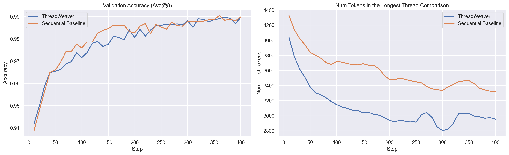

# ThreadWeaver 🧵⚡️
**Adaptive Threading for Efficient Parallel Reasoning in Language Models**

[**Long Lian**](https://tonylian.com/)¹², [**Sida Wang**](https://www.sidaw.xyz/)¹, [**Felix Juefei-Xu**](https://xujuefei.com/)¹, [**Tsu-Jui Fu**](https://tsujuifu.github.io/)¹, [**Xiuyu Li**](https://xiuyuli.com/)², [**Adam Yala**](https://www.adamyala.org/)²³, [**Trevor Darrell**](https://people.eecs.berkeley.edu/~trevor/)², [**Alane Suhr**](https://www.alanesuhr.com/)², [**Yuandong Tian**](https://yuandong-tian.com/)¹, [**Xi Victoria Lin**](https://victorialin.net/)¹

¹Meta Superintelligence Labs (MSL) &nbsp;&bull;&nbsp; ²UC Berkeley &nbsp;&bull;&nbsp; ³UCSF

<div align="center">

[](https://threadweaver-parallel.github.io/)
[](https://arxiv.org/abs/2512.07843)

</div>

## Overview

Scaling inference-time computation has enabled Large Language Models (LLMs) to achieve strong reasoning performance, but inherently sequential decoding leads to substantial latency. We introduce **ThreadWeaver**, a framework for adaptive parallel reasoning that achieves accuracy on par with popular sequential reasoning models while significantly reducing inference latency.

ThreadWeaver utilizes a two-stage parallel trajectory generator for high-quality data creation, a trie-based training-inference co-design for compatibility with off-the-shelf engines, and a parallelization-aware reinforcement learning framework (P-GRPO). Across six mathematical reasoning benchmarks, ThreadWeaver achieves accuracy comparable to cutting-edge sequential models (e.g., 79.9% on AIME24) while delivering up to **1.53x average speedup** in token latency.


Sequential reasoning solves the problem step by step iteratively, so its reasoning latency grows proportionally to the length of the reasoning chain. ThreadWeaver instead creates concurrent reasoning threads adaptively that tackle different parts of the solution through `spawn` and `join` operations, effectively shortening the critical path when additional compute is available.

<details>
<summary><strong>Technical Deep Dive</strong></summary>

## Methodology

### Parallel Trajectory Format

We extend standard autoregressive generation with lightweight control tokens (`<Parallel>`, `<Outlines>`, `<Thread>`) arranged in a fork-join pattern.

<details>
<summary><strong>Deep Dive: Trajectory Structure</strong></summary>

Our format introduces specific tags to manage parallelism:

*   **`<think>`**: Marks the start of the reasoning trajectory, which may contain sequential segments and zero or more parallel blocks.
*   **`<Parallel> ... </Parallel>`**: Defines a parallel block. This is the container for branching logic.
*   **`<Outlines> ... </Outlines>`**: Consists of numbered **`<Outline>`** entries. These declare independent sub-tasks before they are executed. This planning step is crucial for the model to organize its parallel execution.
*   **`<Thread> i`**: The execution trajectory of the *i*-th sub-task. Crucially, **threads are generated independently and must not reference other threads.** At inference, each thread is generated in parallel by the engine.

This structured trajectory allows the model to explicitly define independent sub-tasks. The runtime orchestrator spawns parallel generation for each `<Thread>` while decoding all other segments autoregressively. This means the full trajectory can be generated without any modifications to the underlying inference engine (like vLLM or SGLang).
</details>

### Inference State Machine

Our inference orchestrator manages the "spawn" and "join" operations using standard request-completion APIs, allowing deployment on standard engines like vLLM or SGLang without modification.


<details>
<summary><strong>Deep Dive: The 5-Phase State Machine</strong></summary>

We implement inference as a minimal state machine operating on request-response pairs. This allows us to use standard text-completion APIs without custom CUDA kernels or engine hacks.

1.  **Sequential Phase**: The model decodes sequentially (standard autoregressive generation) until it emits the `</Outlines>` token. This token acts as a stop signal for the sequential phase.
2.  **Parse Outlines**: The orchestrator extracts the numbered `<Outline>` entries from the generated text. These outlines define what needs to be done in parallel.
3.  **Parallel Phase**: For each outline *i*, the orchestrator issues a separate completion request. Each request is seeded with the prompt `<Thread> i:` appended to the previous context. These requests run in parallel on the inference engine. Each thread stops generating when it hits `</Thread>`.
4.  **Join**: Once all threads are complete, the orchestrator concatenates the original context and all the generated thread outputs. It appends the closing `</Parallel>` tag to form the context for the next phase.
5.  **Continue**: The model resumes sequential decoding from the joined context until it hits the next parallel block or the end of the response.

**Why this matters:** Because we use standard API calls, ThreadWeaver inherits all existing serving optimizations like paged attention and prefix caching. Prefix caching is particularly important here, as it prevents re-computing the KV cache for the shared prefix when spawning multiple threads.
</details>

### Trie-Based Training

We flatten the reasoning tree into a single sequence using a Trie structure with ancestor-only attention masking, preventing information leakage between threads during training.


<details>
<summary><strong>Deep Dive: Trie Construction & Masking</strong></summary>

To fine-tune the model to output these parallel structures, we need to align the training data with the inference process. We use a Trie (prefix tree) approach:

1.  **Extraction**: We first extract all `<context, completion>` pairs that the inference state machine would encounter. Each context is a prompt (or partial generation), and each completion is the model's response (e.g., a single thread).
2.  **Trie Construction**: We insert these units into a token-level Trie. The root is the shared prompt. Branches in the Trie represent divergent continuations (e.g., different parallel threads). Nodes share the same ancestor path but are isolated from siblings.
3.  **Flattening & Masking**: We traverse the Trie to produce a single flat sequence for training. Crucially, we build an **ancestor-only attention mask**. Token *i* can attend to token *j* if and only if *j* is an ancestor of *i* in the Trie.

**The Result:** This prevents "cross-thread leakage" during training. Thread 1 cannot attend to Thread 2, even though they are packed into the same training sequence. This ensures that the training objective perfectly matches the independent parallel generation used at inference time.
</details>

### Parallel Trajectory Generation

Obtaining high-quality parallel reasoning data is difficult. We use a two-stage pipeline to create it from sequential data.

*   **Stage 1: Lightweight Rewriting**: We use a strong LLM (GPT-5) to identify parallel blocks in sequential traces. Unlike other methods, we do **not** regenerate the whole text. We perform minimal "surgical" rewrites to remove cross-thread dependencies, preserving the original reasoning quality.
*   **Stage 2: Scalable Self-Training**: We scale from 1k to 17k samples by having the model generate its own parallel data. We filter these trajectories for both **format correctness** and **answer correctness**, creating a massive dataset aligned with the model's own distribution.

### P-GRPO Reinforcement Learning

We introduce Parallelization-Aware GRPO (P-GRPO) to jointly optimize for accuracy and latency reduction.

*   **Parallelization-Aware Reward**: We introduce a dual-objective reward: `Correctness + Acceleration`. The acceleration term is proportional to the reduction in the "critical path" (longest thread), incentivizing the model to parallelize whenever possible without sacrificing accuracy.
*   **Stable Optimization**: Standard RL methods fail with parallel rewards because variance normalization causes the acceleration term to dominate. We introduce **mean-centered normalization** to stably optimize for both speed and accuracy.

<details>
<summary><strong>Deep Dive: P-GRPO & Rewards</strong></summary>

**Parallelization-Aware Reward**

We don't just reward correct answers. We add a soft **acceleration reward**. The total reward is `r = Correctness + Acceleration`. The acceleration term is proportional to the reduction in the "critical path" (longest thread) compared to the total token count. This incentivizes the model to parallelize whenever possible, but *only* if it leads to a correct answer.

**Thread-Wise Advantage Broadcast**

Standard RL methods struggle with parallel branches. In P-GRPO, we compute a single scalar reward for the *entire* trajectory and then **broadcast** the advantage to all tokens in that trajectory. This is mathematically justified and avoids the complexity of assigning partial credit to individual threads.

**Mean-Centered Normalization**

Standard GRPO divides by the standard deviation of rewards. This is problematic when all rollouts are correct: the correctness reward becomes constant and is removed by mean-centering. The remaining variance comes solely from the acceleration term. Dividing by the standard deviation then re-scales this acceleration term to unit variance, effectively cancelling out our small weighting factor ($\rho$) and causing the model to aggressively optimize for speed at the expense of accuracy. We fix this by removing the standard-deviation normalization:

| Standard GRPO | P-GRPO (Ours) |
| :--- | :--- |
| $$A_i = \frac{r_i - \mu}{\sigma}$$ | $$A_i = r_i - \mu$$ |
| Cancels $\rho$ when correct | Preserves scale $\rho$ |

This simple change stabilizes training and maintains a healthy balance between accuracy and speed.

**P-GRPO Loss Function**

The full P-GRPO loss function is defined as:

$$ \mathcal{L}_{\text{P-GRPO}}(\theta) = - \frac{1}{\sum_{p\in\mathcal{B}}\sum_{i=1}^{k} T_{p,i}} \sum_{p\in\mathcal{B}}\sum_{i=1}^{k} A_{p,i} \sum_{m=1}^{M_i} \log \pi_{\theta}(\text{comp}_{p}^{(i,m)} \mid \text{cont}_{p}^{(i,m)}) $$

Where $A_{p,i}$ is the broadcasted advantage, $M_i$ is the number of parallel blocks in trajectory $i$, and the inner sum accumulates log-probs over all completion tokens in the parallel structure.

**Algorithm: P-GRPO Training Loop**

$$
\begin{array}{l}
\textbf{Require: } \text{Post-SFT LLM parameters } \theta; \text{ training prompt set } \mathcal{D}; \\
\quad \quad \quad \quad \text{number of RL iterations } N; \text{ group size } k \\
\textbf{for } j = 0, 1, \ldots, N-1 \textbf{ do} \\
\quad \text{Sample a minibatch } \mathcal{B} \subset \mathcal{D} \text{ of prompts} \\
\quad \textbf{for each } p \in \mathcal{B} \textbf{ do} \\
\quad \quad \text{Roll out } k \text{ parallel trajectories } \{\tau_{p}^{(i)}\}_{i=1}^k \text{ with } \pi_{\theta} \\
\quad \quad \text{Compute } r_{p,i} = \mathcal{R}_{\text{correct}} + \mathcal{R}_{\text{accel}} \text{ for each } \tau_{p}^{(i)} \\
\quad \quad \text{Compute } \mu_p = \text{mean}(\{r_{p,i}\}) \text{ and } A_{p,i}^{\text{P-GRPO}} = r_{p,i} - \mu_p \\
\quad \quad \text{Broadcast } A_{p,i}^{\text{P-GRPO}} \text{ to all tokens of } \tau_{p}^{(i)} \\
\quad \textbf{end for} \\
\quad \text{Form the loss } \mathcal{L}_{\text{P-GRPO}}(\theta) \\
\quad \text{Update parameters with gradient } \nabla_{\theta}\mathcal{L}_{\text{P-GRPO}}(\theta) \\
\textbf{end for}
\end{array}
$$

</details>

## Performance

ThreadWeaver matches the accuracy of sequential baselines while providing substantial speedups across 6 major benchmarks.

### Accuracy & Efficiency Comparison

| Metric | Model | AIME24 | AIME25 | AMC23 | MATH500 | Minerva | Olympiad | Avg |
| :--- | :--- | :--- | :--- | :--- | :--- | :--- | :--- | :--- |
| **Accuracy** | Qwen3-8B (Seq.) | 78.3% | 61.6% | 92.6% | 91.8% | 43.9% | 65.0% | 72.2% |
| | **ThreadWeaver** | **79.9%** | **60.5%** | **92.3%** | **91.4%** | **43.7%** | **63.5%** | **71.9%** |
| **Latency** | Qwen3-8B (Seq.) | 19.4k | 24.6k | 13.8k | 7.2k | 10.6k | 15.2k | 15.1k |
| | **ThreadWeaver** | **16.9k** | **24.0k** | **12.0k** | **6.4k** | **7.3k** | **12.8k** | **13.2k** |
| **Avg Speedup** | | **1.14x** | **1.03x** | **1.16x** | **1.23x** | **1.53x** | **1.21x** | **1.22x** |
| **Max Speedup (correct only)** | | **1.47x** | **1.21x** | **1.67x** | **3.05x** | **3.56x** | **1.92x** | **-** |

### Real-World Wall-Clock Speedup

Token latency is a proxy for critical path length. To verify real-world gains, we measured wall-clock time on 50 MATH500 problems using 4 GPUs.

*   **Sequential Inference**: 162.34s
*   **Parallel Inference (4 GPUs)**: 142.21s
*   **Wall-Clock Speedup**: **1.14x**

### Speedup Distribution Analysis

| AIME 24 | MATH-500 |
| :---: | :---: |
|  |  |

| AMC 23 | OlympiadBench |
| :---: | :---: |
|  |  |

### Comparison with State-of-the-Art

| Model | Size | AIME24 Accuracy | Activation Ratio |
| :--- | :--- | :--- | :--- |
| Multiverse (Yang et al., 2025) | 32B | 53.8% | - |
| Parallel-R1-Unseen (Zheng et al., 2025) | 4B | 16.3% | 27.3% |
| **ThreadWeaver (Ours)** | 8B | **79.9%** | **79.9%** |

## Qualitative Analysis

### Success Case: Trigonometric Expression Evaluation

**Prompt:** Evaluate $\sin (\arcsin 0.4 + \arcsin 0.5) \cdot \sin (\arcsin 0.5 - \arcsin 0.4)$.

ThreadWeaver effectively decomposes this into two parallel paths:
1.  **Path 1**: Uses symbolic identities (product-to-sum).
2.  **Path 2**: Uses numerical verification.

Both paths converge to the same result (0.09), increasing confidence in the final answer.

### Failure Case: Redundant Computation

In some cases (e.g., counting trailing zeros in 42!), the model might split work redundantly.
*   **Thread 1**: Computes the main calculation.
*   **Thread 2**: Redundantly verifies it on smaller numbers (10!, 25!).
This doesn't accelerate the primary task, showing room for improvement in task decomposition.

## Ablation Studies

### Impact of Self-Training & RL

| Model Configuration | Format Correctness | AIME24 Accuracy | Token Latency |
| :--- | :--- | :--- | :--- |
| Qwen3-8B + 1st SFT (959 samples) | 56.4% | 74.5% | 17.6k |
| Qwen3-8B + Self-Training (17k samples) | 77.0% | 74.0% | 17.3k |
| **Qwen3-8B + Self-Training + RL** | **72.4%** | **79.9%** | **16.9k** |

### Reward Normalization (P-GRPO)

| Setting | Accuracy | Mean Longest Thread |
| :--- | :--- | :--- |
| With Std. Normalization | 74.79% | 18.7k |
| **Mean-Centered Only (Ours)** | **79.90%** | **16.9k** |

</details>

## Running ThreadWeaver Data Generation on Polaris-53K

We provide a complete data generation pipeline that transforms sequential reasoning chains into high-quality parallel training trajectories. The pipeline consists of five refinement stages that progressively analyze, restructure, and validate reasoning data.

Starting from model-generated sequential reasoning chains, the pipeline:

1. **Step Extraction**: Analyzes reasoning chains to identify hierarchical step structure (main steps and substeps)
2. **Parallel Path Extraction**: Identifies and marks reasoning segments that explore different approaches in parallel
3. **Context Rewriting**: Refines thread content for clarity and coherence while maintaining mathematical accuracy
4. **Outline Generation**: Creates structured outlines that provide high-level roadmaps for each parallel reasoning block
5. **Quality Filtering**: Validates formatting, completeness, and correctness to ensure only well-formed trajectories are used for training

We provide an overview of the data generation process in this README. **For detailed setup instructions, pipeline explanations, and usage examples, see [data_generation/README.md](data_generation/README.md).**

The command for data generation should be run in `data_generation/` directory.

### Preparation
#### Install the required dependencies
```bash
pip install numpy==1.26.4 pandas==2.2.3 transformers==4.51.1 datasets==3.6.0 torch==2.6.0 openai==1.75.0 sympy==1.13.1 pylatexenc==2.10 matplotlib==3.10.3 tqdm==4.67.1 termcolor==3.1.0 requests==2.32.3 sglang==0.4.6.post1 tokenizers==0.21.1 safetensors==0.5.3 huggingface-hub==0.31.4
```

#### Download polaris-53K dataset
```bash
cd data_generation
mkdir -p data
wget -O data/polaris-data-53K.parquet https://github.com/ChenxinAn-fdu/POLARIS/raw/refs/heads/main/parquet/stage1/polaris-data-53K.parquet
[ "$(md5sum data/polaris-data-53K.parquet | awk '{print $1}')" = "58e1e523f9946956f68055a374d43a46" ] && echo "md5 matches the reference" || echo "md5 does not match the reference"
```

#### Set up your OpenAI API key
Set `OPENAI_KEY_PATH` environment variable to point to a file with the key (default `~/.openai_api_key`). If the file is missing, `OPENAI_API_KEY` env variable will be used.

```bash
export OPENAI_KEY_PATH=~/.openai_api_key
```

### 1. Generate Initial Responses
Run inference on your model to generate initial sequential reasoning chains for mathematical problems.
```bash
CUDA_VISIBLE_DEVICES=0,1,2,3,4,5,6,7 \
python src/generate_trajectories.py \
  --model_name Qwen/Qwen3-8B \
  --launch_server \
  --verbose 1 \
  --template-type model \
  --suffix bfloat16_model_template \
  --bfloat16 \
  --autoregressive \
  -n 1 \
  --max-context-length 40960 \
  --data-type polaris-data-53K \
  --no-conclusion \
  --total-splits 1 \
  --current-split 0
```

### 2. Process to Training Data Format
Filter correct solutions using the reward model, formats them with proper chat templates (DeepSeek/Qwen), and creates training-ready datasets.
```bash
python src/generated_data_to_training_data_polaris.py \
  --dataset-json data/Qwen3-8B_bfloat16_model_template/polaris-data-53K_1.json \
  --polaris-parquet data/polaris-data-53K.parquet \
  --output-dir data/processed \
  --sample-size 1000 \
  --workers 32
```

### 3. Run Multi-Stage Refinement Pipeline
Run the complete 5-stage pipeline to transform reasoning chains into structured parallel trajectories. See "Pipeline Stages Explained" below for details.
```bash
NUM_SAMPLES=1000 ./run.sh
```

**💡 Tip:** Start with a small sample to test the pipeline:
```bash
NUM_SAMPLES=10 ./run.sh  # Annotate just 10 samples first to verify everything works
```

This script will also save the huggingface dataset to `dataset` for training.

### 4. Visualize Results (Optional)
Launch an interactive web UI to browse, search, and analyze the final trajectories with statistics and syntax highlighting.
```bash
python src/visualize_trajectories.py \
  --root data/output_step5 \
  --port 8899
```

Open http://127.0.0.1:8899 in your browser.


## ThreadWeaver Model Training
ThreadWeaver models, reported in the paper, are trained using codebases that leverage Meta's infrastracture. We provide a reproduction of ThreadWeaver on public libraries without any internal dependencies. We verify the accuracy of this implementation on a math multiplication dataset. The code (both SFT and RL) can be run on a single node with 8x80G A100 or H100 GPUs. Multi-node training is also supported.
### Running ThreadWeaver SFT
```bash
cd threadweaver_sft
```

#### Install dependencies
```bash
pip install numpy==1.26.4 pandas==2.2.3 matplotlib==3.10.3 sympy==1.13.1 torch==2.6.0 torchaudio==2.6.0 torchvision==0.21.0 torchao==0.11.0 transformers==4.51.1 datasets==3.6.0 tokenizers==0.21.1 huggingface-hub==0.31.4 safetensors==0.5.3 compressed-tensors==0.9.3 openai==1.75.0 sglang==0.4.6.post1 sgl-kernel==0.1.0 xgrammar==0.1.18 trl==0.19.0 accelerate==1.7.0 peft==0.15.2 deepspeed==0.17.0 liger_kernel==0.5.10 xformers==0.0.29.post2 wandb==0.21.0 tensorboard==2.19.0 nvidia-cuda-runtime-cu12==12.4.127 nvidia-cudnn-cu12==9.1.0.70 nvidia-nccl-cu12==2.21.5 nvidia-cublas-cu12==12.4.5.8 nvidia-cufft-cu12==11.2.1.3 nvidia-curand-cu12==10.3.5.147 nvidia-cusolver-cu12==11.6.1.9 nvidia-cusparse-cu12==12.3.1.170 nvidia-nvtx-cu12==12.4.127 nvidia-nvjitlink-cu12==12.4.127 tqdm==4.67.1 termcolor==3.1.0 packaging==25.0 typing-extensions==4.13.2 pyyaml==6.0.2 regex==2024.11.6 psutil==7.0.0 filelock==3.18.0 flask==2.3.3 fastapi==0.115.12 uvicorn==0.34.2 uvloop==0.21.0 python-multipart==0.0.20 pylatexenc==2.10 requests==2.32.3 pyzmq==26.4.0 orjson==3.10.18 partial-json-parser==0.2.1.1.post5
pip install flash-attn==2.7.4.post1 --no-build-isolation
```

#### Generate data
See [threadweaver_sft/data/README.md](threadweaver_sft/data/README.md) to generate data for a synthetic multiplication task.

#### Obtain model with longer context
```bash
huggingface-cli download Qwen/Qwen3-8B --local-dir ./Qwen/Qwen3-8B-131072
FILE="Qwen/Qwen3-8B-131072/config.json"

if ! grep -q '"max_position_embeddings": 40960,' "$FILE"; then
  echo "Error: target string not found"
else
  sed -i 's/"max_position_embeddings": 40960,/"max_position_embeddings": 131072,/' "$FILE"
fi
```

#### Training
- Prepare a parquet dataset and set `TRAIN_DATA` to its path (must expose `qwen_text`).

Run:
```bash
# Train with synthetic multiplication data:
OUTPUT_DIR=ckpts/Q3-8B-131072-SFT ./train.sh

# Train with your custom training data:
# TRAIN_DATA=/path/to/train/data ./train.sh
```
Key knobs inside `train.sh`: `lr`, `epochs`, `micro_batch_size`, `gradient_accumulation_steps`, `block_size`, `attn_implementation`, `gpu_count`, and `base_model`. Outputs land in `ckpts/Q3-8B-131072-SFT-<timestamp>`.

We also offer a script that trains a sequential baseline:
```bash
OUTPUT_DIR=ckpts/Q3-8B-131072-AR-SFT ./train_ar.sh
```

Note that the sequential baseline uses the same dataset as the parallel model for fairness. Special tokens such as `<Parallel>` are treated as normal text tokens.

#### Attention/Position Visualizer for Training Data
Serves tokens plus attention mask/position ids for a dataset sample using the prefix-tree collator.

Run:
```bash
python src/prefix_tree_visualizer.py \
  --dataset-path data/mult-10k-par_pq/train.parquet \
  --model-name Qwen/Qwen3-8B-131072 \
  --port 8008
```
Open `http://localhost:8008`, pick a sample index, and click tokens to inspect their attention rows. `--text-field` defaults to `qwen_text`; `--template-name` defaults to `qwen`. Uses CPU if CUDA is unavailable.***

#### Quick Evaluation
This is a quick evaluation script that runs parallel generation with SGLang. We recommend using the parallel rollout implementation in veRL for evaluation (see [threadweaver_rl/README.md](threadweaver_rl/README.md)).

```bash
# Replace with your trained model path
TRAINED_MODEL="ckpts/Q3-8B-131072-SFT"

python src/simple_eval.py --data-type data/mult-10k-par_pq/train.parquet --model_name $TRAINED_MODEL --launch_server --verbose 2 --template-type model --bfloat16 --branching-generate -n 1 --max-context-length 8192
```

Reference result:
```
With strict grading function:
Pass@1: 0.9377 (93.77)
```

### Running ThreadWeaver RL
```bash
cd threadweaver_rl
```

ThreadWeaver has a reinforcement learning component for training large language models to generate parallel reasoning paths when solving complex mathematical problems. Built on top of [VERL (Volcano Engine Reinforcement Learning)](https://github.com/volcengine/verl), ThreadWeaver enables models to explore multiple solution strategies simultaneously, improving both solution quality and computational efficiency.

#### Overview

ThreadWeaver trains language models to generate structured reasoning with special tokens that enable parallel exploration of solution paths:

- **`<Parallel>...</Parallel>`**: Marks a block where multiple reasoning threads can execute in parallel
- **`<Thread>...</Thread>`**: Denotes individual reasoning threads within a parallel block
- **`<think>...</think>`**: Wraps the model's chain-of-thought reasoning
- **`<Conclusion>...</Conclusion>`**: Contains the final answer

This parallel reasoning approach allows models to:
- Explore multiple solution strategies simultaneously
- Improve solution robustness through diverse reasoning paths
- Accelerate training and inference through parallel computation
- Achieve better mathematical problem-solving performance

##### Reward Function

The reward function computes rewards based on three components:

1. **Correctness Reward** (`r_correct`):
   - +1.0 for correct answers
   - 0.0 for incorrect answers
   - Uses symbolic math verification and specialized graders

2. **Acceleration Ratio Reward** (`r_accel`):
   - Measures efficiency of parallel reasoning
   - Formula: `r_accel = factor * min(acceleration_ratio - 1.0, clip_max)`
   - Where acceleration ratio = sequential cost / parallel cost
   - Default factor: 0.5, clip_max: 0.2

3. **Combined Reward**:
   ```
   reward = r_correct + r_accel
   ```

The reward function also tracks detailed statistics about parallel structure, thread counts, and token usage.

#### Installation
Please follow the veRL installation instructions at https://github.com/volcengine/verl.

We provide versions of packages:
```bash
pip install numpy==1.26.4 pandas==2.2.3 matplotlib==3.10.3 sympy==1.13.1 torch==2.6.0 torchaudio==2.6.0 torchvision==0.21.0 torchao==0.11.0 transformers==4.51.1 datasets==3.6.0 tokenizers==0.21.1 huggingface-hub==0.31.4 safetensors==0.5.3 compressed-tensors==0.9.3 openai==1.75.0 sglang==0.4.6.post1 sgl-kernel==0.1.0 xgrammar==0.1.18 trl==0.19.0 accelerate==1.7.0 peft==0.15.2 deepspeed==0.17.0 liger_kernel==0.5.10 xformers==0.0.29.post2 wandb==0.21.0 tensorboard==2.19.0 nvidia-cuda-runtime-cu12==12.4.127 nvidia-cudnn-cu12==9.1.0.70 nvidia-nccl-cu12==2.21.5 nvidia-cublas-cu12==12.4.5.8 nvidia-cufft-cu12==11.2.1.3 nvidia-curand-cu12==10.3.5.147 nvidia-cusolver-cu12==11.6.1.9 nvidia-cusparse-cu12==12.3.1.170 nvidia-nvtx-cu12==12.4.127 nvidia-nvjitlink-cu12==12.4.127 tqdm==4.67.1 termcolor==3.1.0 packaging==25.0 typing-extensions==4.13.2 pyyaml==6.0.2 regex==2024.11.6 psutil==7.0.0 filelock==3.18.0 requests==2.32.3 pyzmq==26.4.0 orjson==3.10.18 partial-json-parser==0.2.1.1.post5 flask==2.3.3 fastapi==0.115.12 uvicorn==0.34.2 uvloop==0.21.0 python-multipart==0.0.20 pylatexenc==2.10 codetiming dill hydra-core pybind11 pre-commit "ray[default]==2.52.1" torchdata "pyarrow>=19.0.0" "tensordict>=0.8.0,<=0.10.0,!=0.9.0" latex2sympy2_extended math_verify gunicorn==23.0.0 vllm==0.8.5.post1
pip install flash-attn==2.7.4.post1 opentelemetry-sdk==1.39.1 opentelemetry-exporter-prometheus==0.60b1 --no-build-isolation
```

##### Prepare Your SFT Model

ThreadWeaver requires a supervised fine-tuned (SFT) model as initialization. The model should be trained to:
- Use `<think>...</think>` tokens for reasoning
- Generate answers in `\boxed{}` format
- Use the parallel reasoning structure as specified in the ThreadWeaver paper.

See the [ThreadWeaver SFT](threadweaver_sft/README.md) documentation for SFT training instructions.

Both the SFT and RL can be run on a single node with 8x80G A100 or H100 GPUs. Multi-node training is also supported.

##### Single-Node Training
```bash
# ThreadWeaver
export VLLM_USE_V1=1
MODEL_PATH=../threadweaver_sft/ckpts/Q3-8B-131072-SFT
PYTHONUNBUFFERED=1 python3 -m verl.trainer.main_ppo algorithm.adv_estimator=grpo data.train_files="../threadweaver_sft/data/mult-10k-par_pq/train.parquet" data.val_files="../threadweaver_sft/data/mult-10k-par_pq/val.parquet" data.filter_overlong_prompts=True data.train_batch_size=128 data.val_batch_size=512 data.max_prompt_length=9216 data.max_response_length=8192 actor_rollout_ref.model.path=$MODEL_PATH actor_rollout_ref.actor.optim.lr=1e-6 actor_rollout_ref.model.use_remove_padding=True actor_rollout_ref.actor.ppo_micro_batch_size_per_gpu=null actor_rollout_ref.actor.ppo_mini_batch_size=null actor_rollout_ref.actor.use_dynamic_bsz=True actor_rollout_ref.actor.ppo_max_token_len_per_gpu=10240 actor_rollout_ref.rollout.max_num_batched_tokens=10240 actor_rollout_ref.actor.use_kl_loss=False actor_rollout_ref.actor.kl_loss_coef=0 actor_rollout_ref.actor.kl_loss_type=low_var_kl actor_rollout_ref.actor.entropy_coeff=0 actor_rollout_ref.actor.clip_ratio_low=0.2 actor_rollout_ref.actor.clip_ratio_high=0.28 actor_rollout_ref.actor.ulysses_sequence_parallel_size=1 actor_rollout_ref.model.enable_gradient_checkpointing=True actor_rollout_ref.actor.fsdp_config.param_offload=True actor_rollout_ref.actor.fsdp_config.optimizer_offload=True actor_rollout_ref.actor.fsdp_config.fsdp_size=-1 actor_rollout_ref.actor.grad_clip=1.0 actor_rollout_ref.rollout.tensor_model_parallel_size=1 actor_rollout_ref.rollout.name=vllm actor_rollout_ref.rollout.temperature=1.0 actor_rollout_ref.rollout.top_p=1.0 actor_rollout_ref.rollout.top_k=-1 actor_rollout_ref.rollout.enable_chunked_prefill=True actor_rollout_ref.rollout.n=8 actor_rollout_ref.rollout.gpu_memory_utilization=0.8 actor_rollout_ref.rollout.val_kwargs.do_sample=True actor_rollout_ref.rollout.val_kwargs.temperature=1.0 actor_rollout_ref.rollout.val_kwargs.top_p=1.0 actor_rollout_ref.rollout.val_kwargs.n=8 actor_rollout_ref.ref.fsdp_config.param_offload=True actor_rollout_ref.rollout.enforce_eager=False actor_rollout_ref.rollout.free_cache_engine=True algorithm.use_kl_in_reward=False algorithm.norm_adv_by_std_in_grpo=False trainer.critic_warmup=0 trainer.logger=['console','tensorboard','wandb'] trainer.project_name='deepscaler' trainer.experiment_name="1n-p1-nonrm-8k-multv5-10k-par-a0.5am0.2_rva2_par_bfl-1217" trainer.val_before_train=False trainer.n_gpus_per_node="8" trainer.nnodes="1" trainer.save_freq=10 trainer.test_freq=10 trainer.default_hdfs_dir=null trainer.total_epochs=30 actor_rollout_ref.rollout.max_model_len=8192 reward_model.config.acceleration_ratio_reward=1.0 reward_model.config.acceleration_ratio_reward_factor=0.5 reward_model.config.acceleration_ratio_clip_max=0.2 reward_model.config.version=v2 reward_model.config.require_think_end=False reward_model.reward_manager_type=reward_manager_with_server actor_rollout_ref.rollout.agent.num_workers=8 actor_rollout_ref.rollout.agent.enable_parallel_branching=True actor_rollout_ref.rollout.agent_return_expanded_sequences=True actor_rollout_ref.rollout.agent.no_conclusion=true algorithm.broadcast_from_last=True reward_model.config.strip_comma_from_answer=True data.return_raw_chat=True actor_rollout_ref.rollout.mode=async trainer.max_actor_ckpt_to_keep=3

# Sequential Baseline
export VLLM_USE_V1=1
MODEL_PATH=../threadweaver_sft/ckpts/Q3-8B-131072-AR-SFT
PYTHONUNBUFFERED=1 python3 -m verl.trainer.main_ppo algorithm.adv_estimator=grpo data.train_files="../threadweaver_sft/data/mult-10k-par_pq/train.parquet" data.val_files="../threadweaver_sft/data/mult-10k-par_pq/val.parquet" data.filter_overlong_prompts=True data.train_batch_size=128 data.val_batch_size=512 data.max_prompt_length=9216 data.max_response_length=8192 actor_rollout_ref.model.path=$MODEL_PATH actor_rollout_ref.actor.optim.lr=1e-6 actor_rollout_ref.model.use_remove_padding=True actor_rollout_ref.actor.ppo_micro_batch_size_per_gpu=null actor_rollout_ref.actor.ppo_mini_batch_size=null actor_rollout_ref.actor.use_dynamic_bsz=True actor_rollout_ref.actor.ppo_max_token_len_per_gpu=10240 actor_rollout_ref.rollout.max_num_batched_tokens=10240 actor_rollout_ref.actor.use_kl_loss=False actor_rollout_ref.actor.kl_loss_coef=0 actor_rollout_ref.actor.kl_loss_type=low_var_kl actor_rollout_ref.actor.entropy_coeff=0 actor_rollout_ref.actor.clip_ratio_low=0.2 actor_rollout_ref.actor.clip_ratio_high=0.28 actor_rollout_ref.actor.ulysses_sequence_parallel_size=1 actor_rollout_ref.model.enable_gradient_checkpointing=True actor_rollout_ref.actor.fsdp_config.param_offload=True actor_rollout_ref.actor.fsdp_config.optimizer_offload=True actor_rollout_ref.actor.fsdp_config.fsdp_size=-1 actor_rollout_ref.actor.grad_clip=1.0 actor_rollout_ref.rollout.tensor_model_parallel_size=1 actor_rollout_ref.rollout.name=vllm actor_rollout_ref.rollout.temperature=1.0 actor_rollout_ref.rollout.top_p=1.0 actor_rollout_ref.rollout.top_k=-1 actor_rollout_ref.rollout.enable_chunked_prefill=True actor_rollout_ref.rollout.n=8 actor_rollout_ref.rollout.gpu_memory_utilization=0.8 actor_rollout_ref.rollout.val_kwargs.do_sample=True actor_rollout_ref.rollout.val_kwargs.temperature=1.0 actor_rollout_ref.rollout.val_kwargs.top_p=1.0 actor_rollout_ref.rollout.val_kwargs.n=8 actor_rollout_ref.ref.fsdp_config.param_offload=True actor_rollout_ref.rollout.enforce_eager=False actor_rollout_ref.rollout.free_cache_engine=True algorithm.use_kl_in_reward=False algorithm.norm_adv_by_std_in_grpo=False trainer.critic_warmup=0 trainer.logger=['console','tensorboard','wandb'] trainer.project_name='deepscaler' trainer.experiment_name="1n-p1-nonrm-8k-multv5-10k-par-ar-a0.5am0.2_rva2_seq-1217" trainer.val_before_train=False trainer.n_gpus_per_node="8" trainer.nnodes="1" trainer.save_freq=10 trainer.test_freq=10 trainer.default_hdfs_dir=null trainer.total_epochs=30 actor_rollout_ref.rollout.max_model_len=8192 reward_model.config.acceleration_ratio_reward=1.0 reward_model.config.acceleration_ratio_reward_factor=0.5 reward_model.config.acceleration_ratio_clip_max=0.2 reward_model.config.version=v2 reward_model.config.require_think_end=False reward_model.reward_manager_type=reward_manager_with_server actor_rollout_ref.rollout.agent.num_workers=8 actor_rollout_ref.rollout.agent.enable_parallel_branching=False actor_rollout_ref.rollout.agent_return_expanded_sequences=True actor_rollout_ref.rollout.agent.no_conclusion=true reward_model.config.strip_comma_from_answer=True data.return_raw_chat=True actor_rollout_ref.rollout.mode=async trainer.max_actor_ckpt_to_keep=3
```

##### Multi-Node Training

1. **Edit the SLURM script**:
```bash
vim multinode_run.slurm
```

Update the following variables:
- `SBATCH --partition=`: Your SLURM partition
- `SBATCH --qos=`: Your QoS
- `SBATCH --account=`: Your account
- `MODEL_PATH`: Path to your SFT checkpoint
- `TRAIN_FILES`: Path to training data
- `VAL_FILES`: Path to validation data

2. **Submit the job**:
```bash
sbatch multinode_run.slurm
```

3. **Monitor progress**:
```bash
tail -f slurm-<job-id>.out
# Or view TensorBoard logs
tensorboard --logdir=./tensorboard_log
```

#### TensorBoard

ThreadWeaver logs training metrics to TensorBoard:

```bash
tensorboard --logdir=./tensorboard_log
```

Key metrics:
- `reward/mean`: Average reward per epoch
- `reward/std`: Reward standard deviation
- `metrics/correct_rate`: Fraction of correct answers
- `metrics/acceleration_ratio`: Average acceleration
- `metrics/parallel_usage`: Percentage using parallel blocks
- `loss/policy_loss`: Policy gradient loss
- `loss/value_loss`: Value function loss

##### Computing acceleration w.r.t. sequential baseline
The acceleration ratio w.r.t. the sequential baseline is computed as follows:
```
acceleration_ratio = the total number of tokens in the sequential baseline / the total number of tokens in the longest path of the parallel baseline (i.e., the critical path in terms of the number of tokens)
```

The former is listed as the `total_num_tokens` and the latter as the `num_tokens_in_the_longest_thread`

### Reference Results
We train both models for 400 steps. The sequantial model and the parallel model achieve very close accuracy after 400 steps of training.

| Setting | Num Tokens in the Longest Thread | Accuracy (%) |
| :--- | :---: | :--- |
| Sequential Baseline | 3322 | 99.0% |
| Parallel Model (ThreadWeaver) | 2632 | 99.0% |

ThreadWeaver achieves a speedup of 1.26x w.r.t. the sequential baseline in terms of token latency.



## License
Threadweaver is CC BY-NC 4.0 licensed, as found in the LICENSE file.

## Citation

If you find our work helpful or inspiring for your research, please cite it as follows:

```bibtex
@article{lian2025threadweaver,
  title={ThreadWeaver: Adaptive Threading for Efficient Parallel Reasoning in Language Models},
  author={Lian, Long and Wang, Sida and Juefei-Xu, Felix and Fu, Tsu-Jui and Li, Xiuyu and Yala, Adam and Darrell, Trevor and Suhr, Alane and Tian, Yuandong and Lin, Xi Victoria},
  journal={arXiv preprint arXiv:2512.07843},
  year={2025}
}
```

## Acknowledgements
We thank the Polaris team for providing the Polaris-53K dataset. Our prompts for the first stage of data generation (step extraction stage) are adapted from the prompts of Multiverse.
